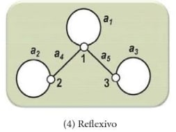

# Tipos de grafos

## Grafo reflexivo

É um [pseudografo](p0003_pseudografo.md) onde **todos os vértices possuem um laço**.

---

**Referência**

_Goldbarg, M. (2012). Grafos: Conceitos, Algoritmos e Aplicações, página 177. Elsevier._

tags: grafos, grafo reflexivo, laço, pseudografo
