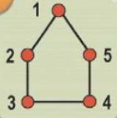
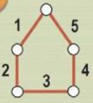

# Tipos de grafos

## Grafo rotulado

**Rótulos** são **anotações** que permitem distinguir vértices e arestas.

Sendo assim, o grafo pode ser rotulado nos vértices.

Ou nas arestas.

---

**Referência**

_Goldbarg, M. (2012). Grafos: Conceitos, Algoritmos e Aplicações, página 178. Elsevier._

tags: grafos, grafo nulo, vértices, arestas, rótulos
