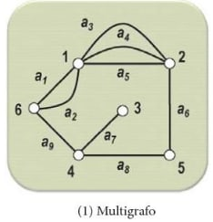
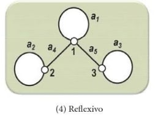
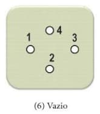
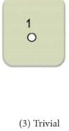

# Tipos de grafos - parte 0000

Uma aresta que liga um vértice a ele mesmo é denominada de **laço**.

Se duas ou mais arestas representam ligações diferentes entre vértices idênticos, são denominadas **arestas paralelas**.

Denominamos de **grafo simples**, um grafo qualquer que não possui laços nem arestas paralelas.

Um grafo que contém pelo menos um laço é denominado de **pseudografo**.

Um grafo não direcionado que possui pelo menos duas arestas paralelas é denominado de **multigrafo**. Se o grafo for direcionado, então se chamará **multigrafo direcionado**.

Um pseudografo onde todos os vértices possuem um laço é denominado **grafo reflexivo**.

É um **grafo vazio** aquele que só possui exclusivamente vértices. 

Um **grafo trivial** é aquele que possui apenas um vértice.

**Grafo nulo** é aquele que não possui vértices.

---

**Referência**

_Goldbarg, M. (2012). Grafos: Conceitos, Algoritmos e Aplicações, página 177. Elsevier._

tags: grafos, multigrafo, pseudografo, grafoSimples
