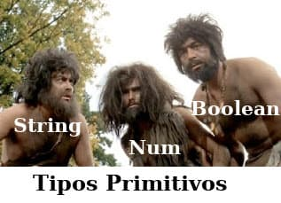

# Os tipos primitivos no JavaScript



De modo geral, um tipo primitivo é aquele dado que não é representado através de um Objeto e, por isso, não possui métodos. Eles também tem a característica de serem imutáveis (não podem ter o seu valor modificado).

O JavaScript possui 6 tipos primitivos:

- String;
- Number;
- Boolean;
- Null;
- undefined;
- Symbol.

Exceto **null** e o **undefined**, os outros primitivos tem um objeto equivalente.

Através do comando **typeof** é possível verificar o tipo de uma variável. Exemplo:
```js
//atribuindo as variáveis
let meuNumero = 10;
let minhaString = "Olá, mundo!";
let meuBoobleano = true;
let meuNull = null;
let meuUndefined = undefined;

//imprimindo na tela as variáveis e seus respectivos tipos
console.log("Meu número é: ", meuNumero);
console.log("O tipo do número é: ", typeof meuNumero);
console.log("O tipo da minha string é: ", typeof minhaString);
console.log("O tipo do meu booleano é: ", typeof meuBoobleano);
console.log("O tipo da meu null é: ", typeof meuNull);
console.log("O tipo da meu undefined é: ", typeof meuUndefined);
```

Segundo a _MDN Web Docs_, o **null** aponta para um objeto inexistente ou endereço de memória inválido. Em Ciência da Computação, um valor nulo representa a ausência intencional de qualquer objeto.

---

**Referência**

"MDN Web Docs". https://developer.mozilla.org/pt-BR/docs/Glossario/Primitivo Acessado em novembro 2019.

tags: tipos, primitivos, javascript, programacao
