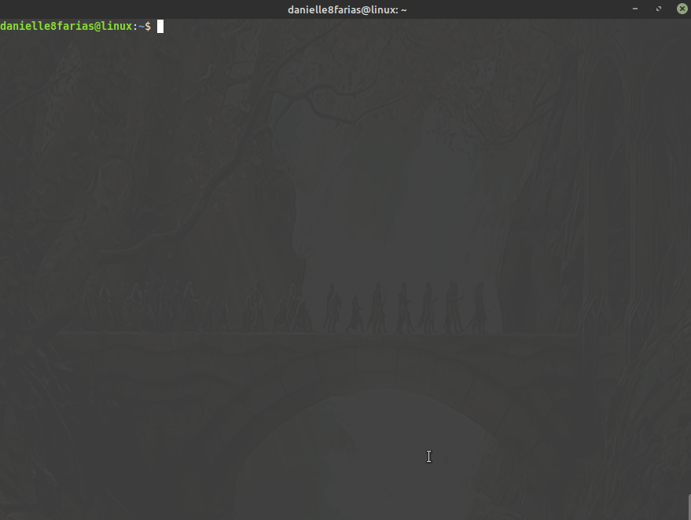
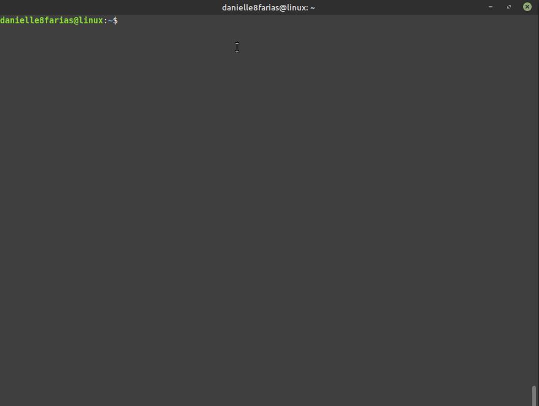
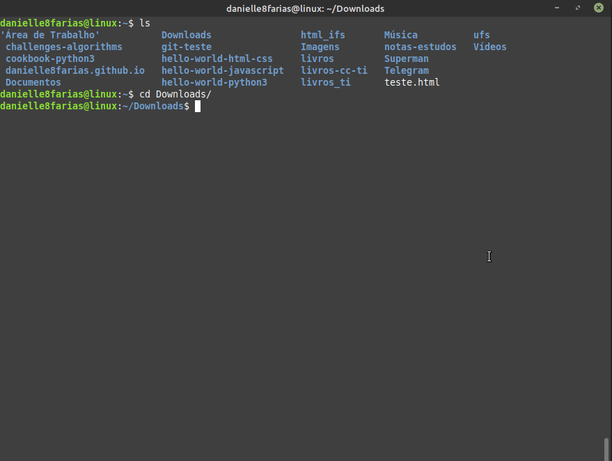

# Terminal: Instalando programas


Essa instrução serve para as distros Linux baseadas no Debian (Ubuntu, Mint e derivados).

## Usando o apt

```
$ sudo apt install <nome_do_programa>
```

- **$** indica que você deve usar o **usuário comum** para fazer essa operação.

- **sudo** serve para pedir permissões de administrador temporariamente.

- **apt** do inglês, *Advanced Package Tool*, em português, Ferramenta de Empacotamento Avançada; é a ferramenta que nos ajuda na instalação, atualização e desinstalação de programas, entre outras funções.

- **install** é o comando de instalar, indicando ao apt o que fazer.

- digite o nome do programa sem os sinais **< >**.

Provavelmente, após esse comando o sistema irá pedir a **senha** que você configurou no início da instalação do sistema operacional.



Para fazer a instalação sem a pergunta de confirmação, basta acrescentar o **-y** ao final do comando.

```
$ sudo apt install <nome_do_programa> -y
```


## Instalando um pacote .deb

Caso você tenha um pacote **.deb** que deseja instalar, vá até a pasta onde está o arquivo 



e digite no terminal

```
$ sudo apt install ./<nome_do_pacote>.deb
```

Desse modo todas as dependências serão verificadas e instaladas.

- O **ponto-barra** juntos serve para indicar o caminho do executável;

- o **ponto** significa diretório atual;

- a **barra** serve para separar o diretório do nome do arquivo

## Instalando um pacote .deb usando o dpkg

Vá até a pasta onde está o arquivo **.deb** e digite no terminal:

```
$ sudo dpkg -i <nome_do_pacote>.deb
```

- **dpkg** do inglês, *Debian Package*, é uma ferramenta que gerencia pacotes .deb.

- **i** é o comando de instalar, indicando ao dpkg o que fazer.

Exemplo:



Dessa maneira porém, as dependências não são instaladas, para corrigir isso, digite:

```
$ sudo apt install -f
```

- **-f** do inglês, *fix*, para corrigir o que falta.

Caso haja algo que precise de reparo, será mostrado na tela, pedindo a confirmação do usuário.

tags: linux, instalacao, apt, terminal, dpkg
