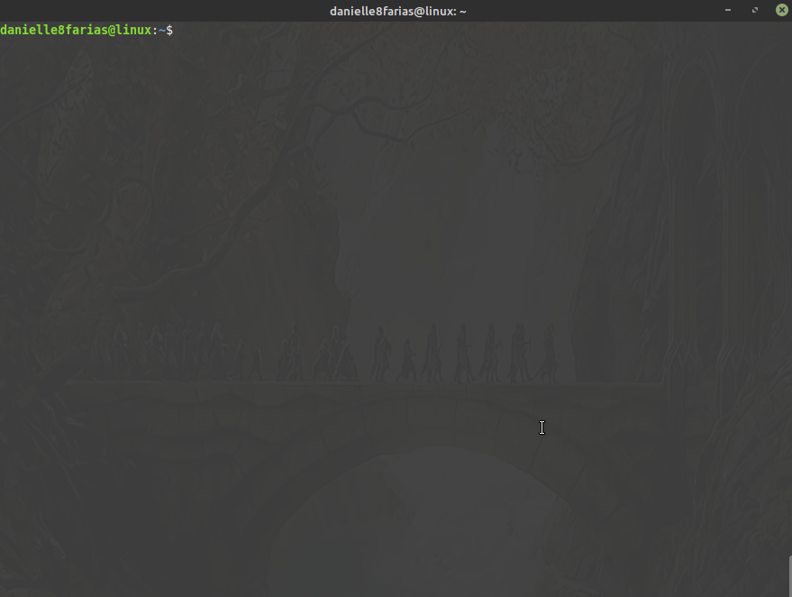
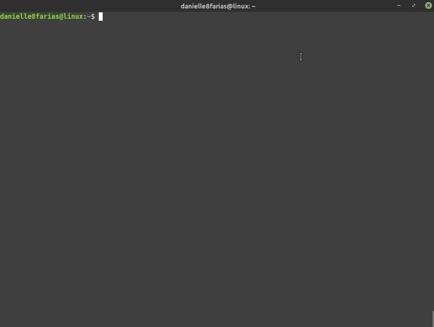

# Terminal: Desinstalando programas

Essa instrução serve para as distros Linux baseadas no Debian (Ubuntu, Mint e derivados) e que usam a ferramenta **apt**.


## Usando o apt

```
$ sudo apt remove <nome_do_programa>
```

- **$** indica que você deve usar o **usuário comum** para fazer essa operação.

- **sudo** serve para pedir permissões de administrador temporariamente.

- **apt** do inglês, *Advanced Package Tool*, em português, Ferramenta de Empacotamento Avançada; é a ferramenta que nos ajuda na instalação, atualização e desinstalação de programas, entre outras funções.

- **remove** é o comando para remover, indicando ao apt o que fazer.

- digite o nome do programa sem os sinais **< >**.

Provavelmente, após esse comando o sistema irá pedir a **senha** que você configurou no início da instalação do sistema operacional; além do pedido de confirmação da desinstalação.



Esse comando remove os pacotes, mas deixa os dados de configurações. Para removê-lo por completo, incluindo as configurações, utilize:

```
$ sudo apt purge <nome_do_programa>
```



## Usando o dpkg

Você também pode usar o **dpkg** para remover pacotes **.deb** que foram instalados. Assim,

```
$ sudo dpkg -r <nome_do_programa>
```

- **dpkg** do inglês, *Debian Package*, é uma ferramenta que gerencia pacotes .deb.

- **r** é o comando de remover, indicando ao dpkg o que fazer.

Para remover inclusive as configurações, digite:

```
$ sudo dpkg -P <nome_do_programa>
```

- **-P** do inglês, *purge*, para limpar.

tags: linux, desinstalação, apt, terminal, dpkg, remove
