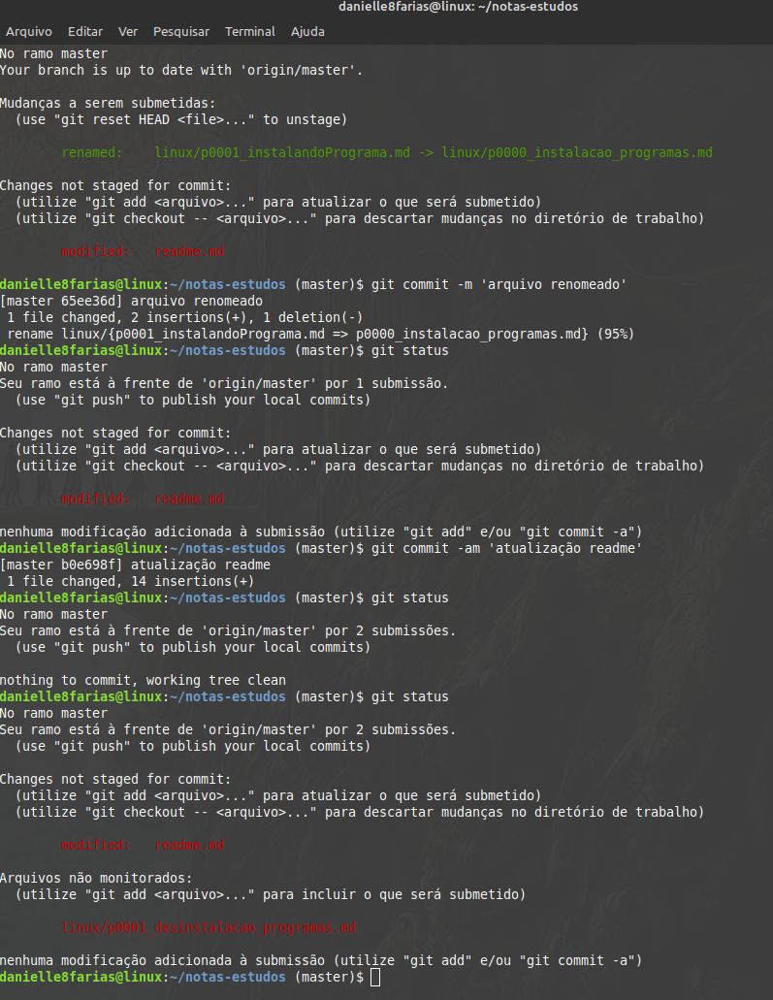
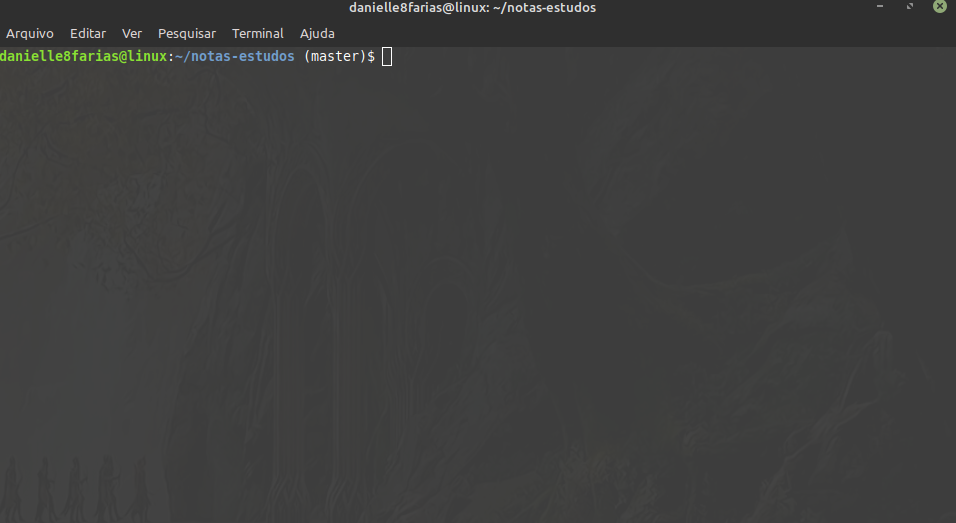

# Terminal: Limpando a tela




É bem comum de acontecer do terminal ficar cheio de comandos, enquanto estamos usando-o. Caso precise limpar a tela, como se você tivesse acabado de abrir um terminal novo, basta digitar o comando

```
$ clear
```

- **$** indica que você deve usar o **usuário comum** para fazer essa operação.

## Usando um atalho

Ou ainda, usar o atalho **Ctrl + L**.



tags: linux, terminal, clear, limpar
