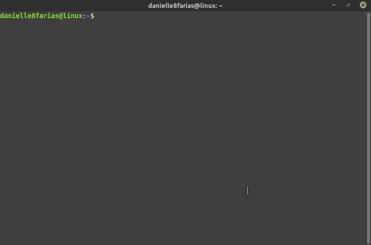
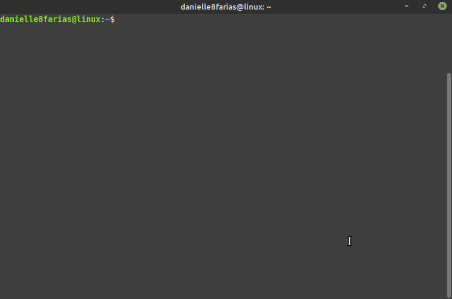
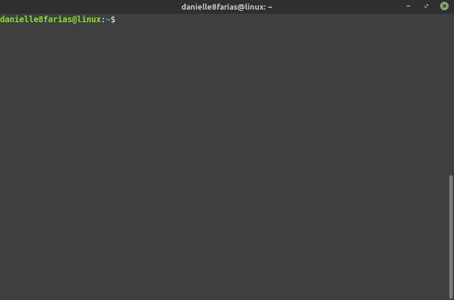
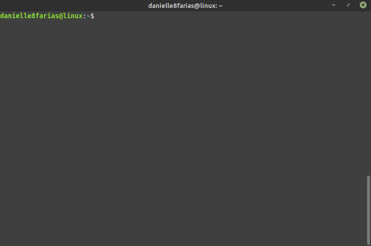
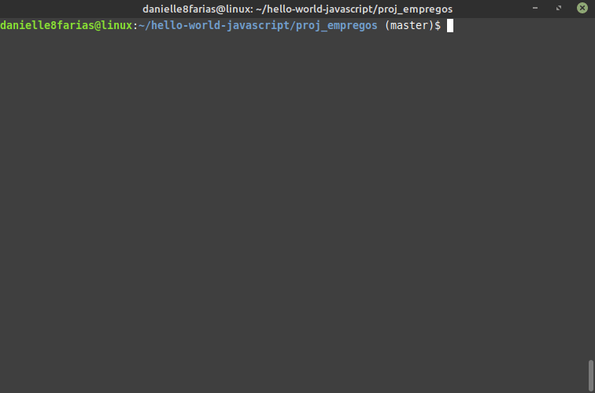
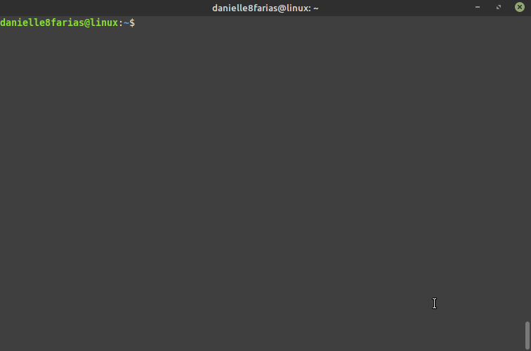
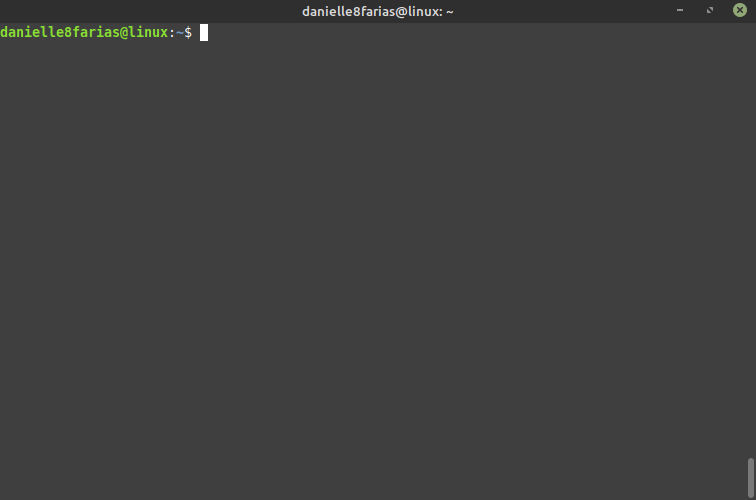

# Terminal: Listando arquivos e diretórios


No terminal, digite:

```
$ ls
```

- **$** indica que você deve usar o **usuário comum** para fazer essa operação.

- **ls** o comando de listar os conteúdos de um diretório.

Isso fará com que o terminal exiba o nome dos arquivos e diretórios no local em que o terminal está.



## Listar arquivos e suas especificações

Ao digitar:

```
$ ls -l
```

- **-l** traz mais informações sobre os arquivos listados.

O terminal mostrará arquivos e diretórios com as permissões, números de arquivos, proprietário dos arquivos, tamanho, data e hora modificada e nome dos arquivos.



Ao digitar:

```
$ ls -lh
```

- **-lh** é a junção dos argumentos l e h.

- **h** do inglês, *human readable*, nos mostra os tamanhos em um formato mais legível para humanos, como KB, MB ou GB.

O terminal exibirá os tamanhos dos arquivos de forma mais legível a humanos.



## Listar também arquivos ocultos

Digitando:

```
$ ls -a
```

- **-a** do inglês, **all**, inclui também os arquivos e diretórios ocultos.



Digitando:

```
$ ls -R
```

O terminal lista os arquivos, diretórios e subdiretórios, bem como os arquivos contidos nesses.

- **-R**, de recursivo.



## Listar arquivos de qualquer lugar

Para listar arquivos de um diretório o qual você não está, basta fornecer o caminho completo até o diretório desejado. Por exemplo:

```
$ ls /home/usuario/Música
```


## Atalho para a home do usuário

Caso deseje listar os arquivos que estão dentro da home do usuário, pode se usar o sinal diacrítico til **~**. Exemplo:

```
$ ls ~/Música
```



## Listar conteúdos em mais de um diretório ao mesmo tempo

É possível listar o conteúdo em mais de um diretório ao mesmo tempo, basta indicá-los depois do ls:

```
$ ls ~ /opt /tmp
```



tags: terminal, linux, diretorios, ls
