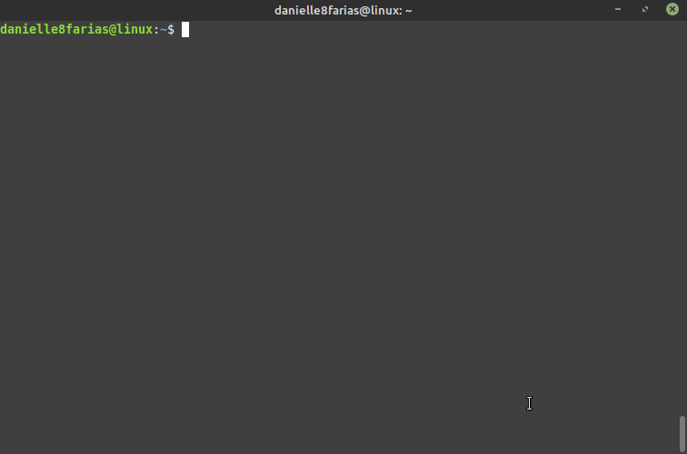
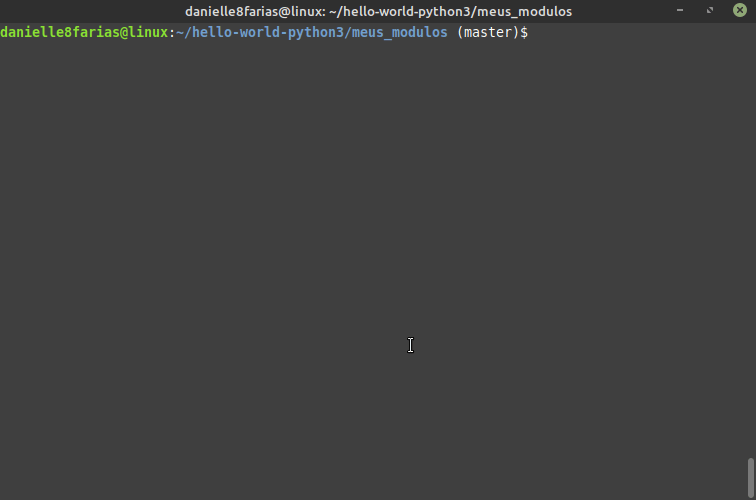
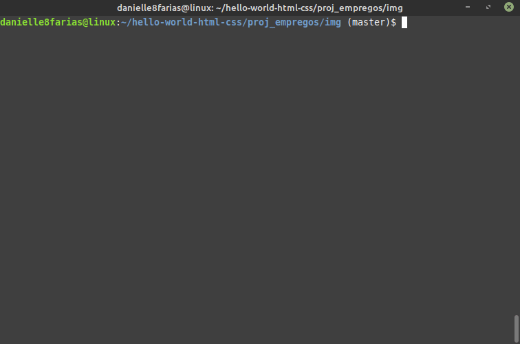
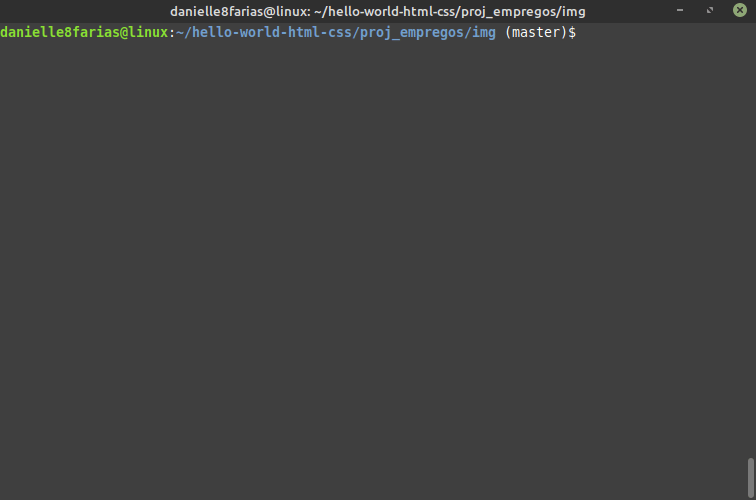

# Terminal: Navegando nos diretórios


## Ver diretório atual

Para saber em que diretório você se encontra, digite no terminal:

```
$ pwd
```

- **$** indica que você deve usar o **usuário comum** para fazer essa operação.

- **pwd** do inglês, *print name of current/working directory*, imprime na tela o nome do diretório atual.


A exibição de:

```
usuario@computador:~$
```

no terminal indica que você está no diretório /home/seu_nome_de_usuário. Perceba que depois dos dois pontos temos o **sinal diacrítico til**.

## Mudando de diretório

Para seguir até a pasta de downloads, basta digitar:

```
$ cd Downloads/
```

E no terminal será exibido:

```
usuario@computador:~/Downloads
```

- **cd** do inglês, *change directory*, serve para mudar de diretório/pasta.


## Usando a tecla TAB para completar o nome do diretório

Aqui vale a dica de iniciar a escrita do diretório desejado e utilizar a tecla **TAB** para a função de autocompletar.

```
$ cd Do [pressione a tecla 'tab' para completar]
```

Se houver mais de um diretório com as mesmas iniciais, será preciso apertar a tecla **TAB** duas vezes para que o terminal retorne o nome das pastas e você possa escolher qual precisa.

```
$ cd Do [pressionando o 'tab' duas vezes]
Documentos/     /Downloads
```


## Navegando para um determinado diretório de qualquer lugar

Também é possível entrar no diretório citando o caminho completo. Exemplo:

```
$ cd /usr/games
```



## Atalho para a home do usuário

Caso deseje entrar em algum diretório que esteja na home do usuário, pode se usar o sinal diacrítico til **~**. Exemplo:

```
$ cd ~/Imagens
```


## Retornar ao diretório acima

Para retornar um diretório acima do atual, digite:

```
$ cd ..
```



## Navegando para o diretório home do usuário de qualquer lugar

Para retornar diretamente a pasta /home/seu_nome_de_usuário, não importa onde você esteja, digite:

```
$ cd
```



## Retornar dois diretórios acima

Para retornar duas pastas acima da atual, digite:

```
$ cd ../..
```


## Retornar ao diretório anterior

Para retornar ao diretório anterior, no qual você estava

```
$ cd -
```

- **-**, sinal de menos. Esse operador é equivalente ao comando

```
$ cd $OLDPWD && pwd
```

que mostra o seu endereço atual na tela e retorna o usuário ao diretório anterior.

Exemplo do uso do **cd -**:



## Diretório raiz

A exibição de:

```
usuario@computador:/$
```

no terminal indica que você está no diretório raiz. Perceba que depois dos dois pontos **não temos** o sinal diacrítico til, mas temos a **barra**.

Para seguir diretamente para o diretório raiz basta digitar:

```
$ cd /
```


## Navegando por diretório com nomes compostos

Para diretórios com nomes compostos, usa-se a **contrabarra (barra invertida)** ao final de cada palavra. Exemplo:

```
$ cd Área\ de\ Trabalho
```

Ou ainda, usa-se aspas (duplas ou simples). Assim,

```
$ cd 'Área de Trabalho'
```

tags: linux, diretorio, cd, pastas
