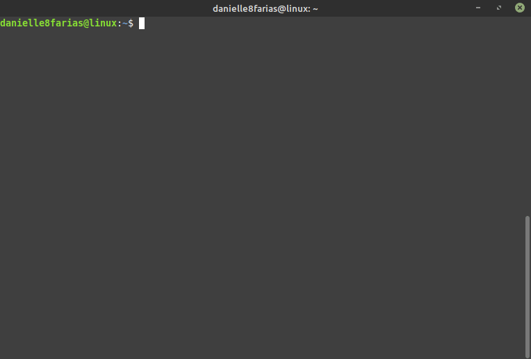
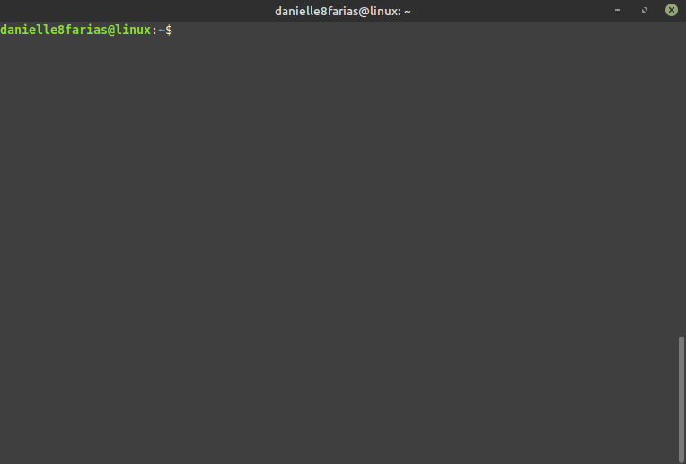
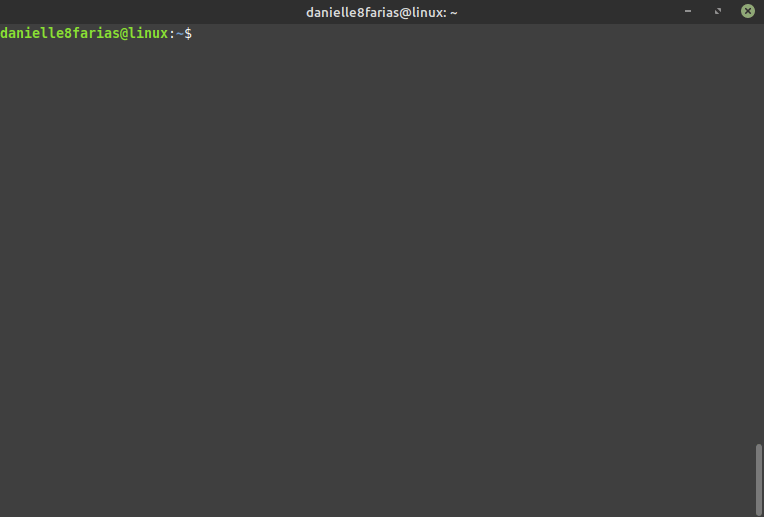
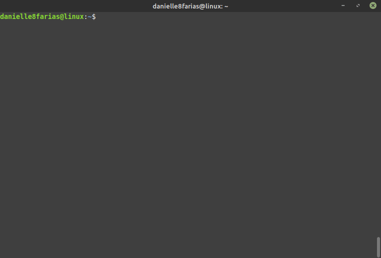
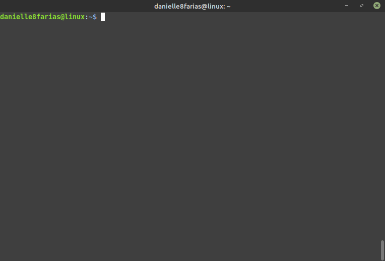

# Terminal: Criando diretório


No terminal digite:

```
$ mkdir <nome_do_diretório>
```

- **$** indica que você deve usar o **usuário comum** para fazer essa operação.

- **mkdir** do inglês, *make directory*, é o comando que vai criar o nosso novo diretório/pasta.

- digite o nome do diretório sem os sinais **< >**.



Para ver um retorno da tela de que o diretório foi criado com sucesso, basta usar o argumento **-v**, assim

```
$ mkdir -v <nome_do_diretório>
```



## Criando vários diretórios ao mesmo tempo

Para criar mais de um diretório ao mesmo tempo, basta usar o comando mkdir, com o nome dos diretórios e um espaço entre eles. Exemplo:

```
$ mkdir js css img
```

Acima, criamos três diretórios simultaneamente.



## Criando um subdiretório

Para criar um subdiretório, em um diretório já existente, digite:

```
$ mkdir <diretório_que_já_existe>/<novo_diretório>
```



## Criando um diretório e um subdiretório

Para criar um diretório e um subdiretório ao mesmo tempo, digite:

```
$ mkdir -p <diretório>/<subdiretório>
```

- **-p** do inglês, *parents*, se o diretório pai não existir, ele será criado. É o que permite a criação dos dois juntos; o diretório filho e o diretório pai.



tags: linux, terminal, mkdir
