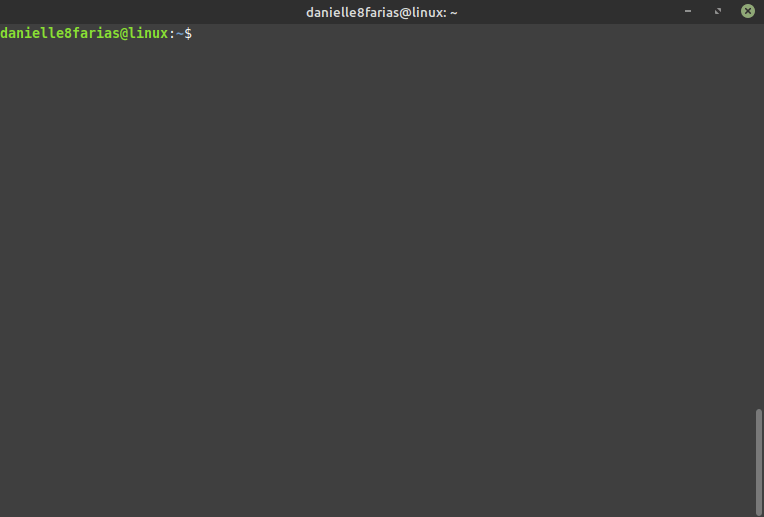
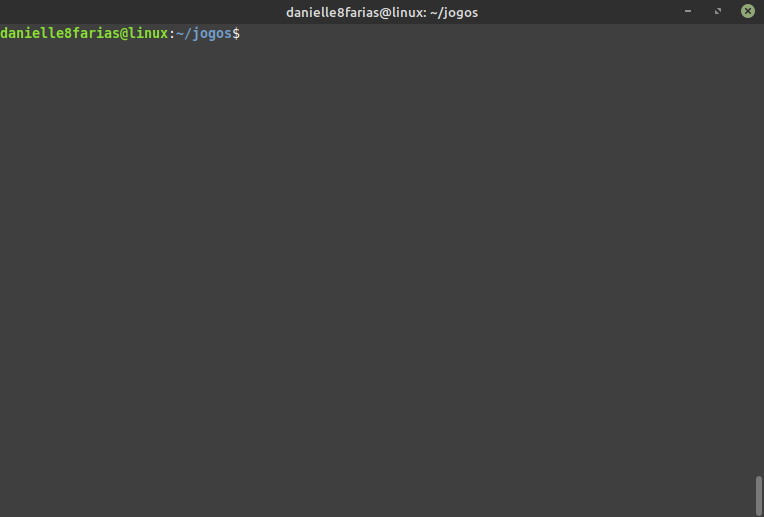
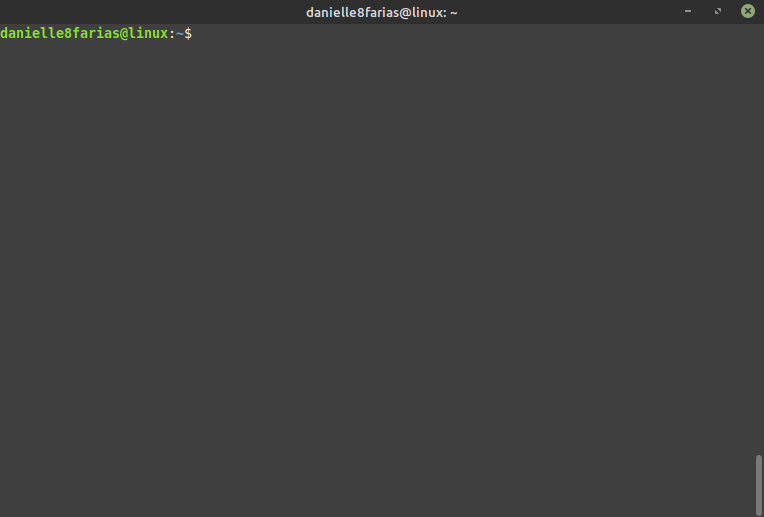
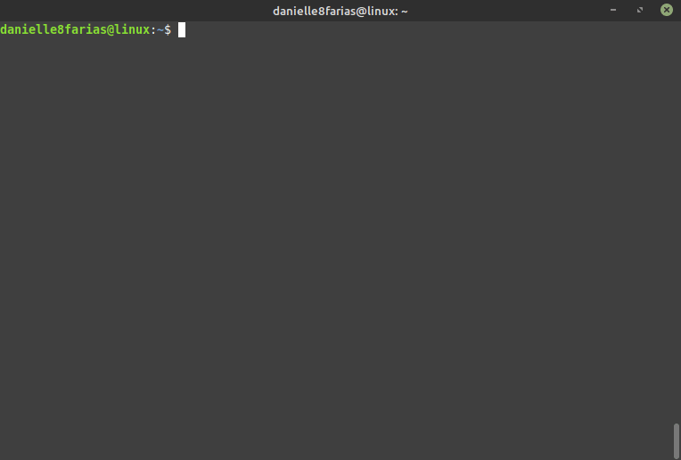
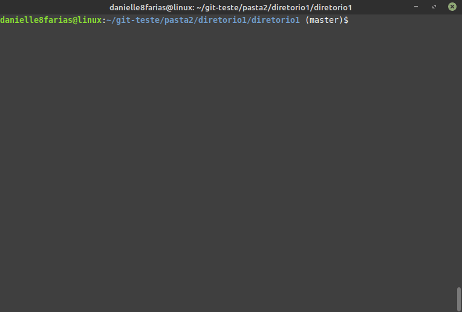
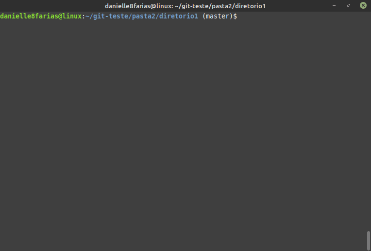
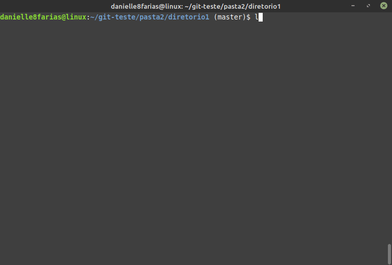

# Terminal: Removendo arquivos e diretórios

## Removendo um diretório vazio


> [toca a sirene de Kill Bill](https://www.youtube.com/watch?v=cOy6hqzfsAs)

Para excluir uma pasta vazia, usamos o comando:

```
$ rmdir <nome_da_pasta>
```

- **$** indica que você deve usar o **usuário comum** para fazer essa operação.

- **rmdir** do inglês,*remove directory*, é o comando que vai excluir a pasta/diretório.

- digite o nome da pasta sem os sinais **< >**.



Outra maneira de excluir um diretório vazio é usando o comando **rm** com o argumento **-d**, assim

```
$ rm -d <nome_do_diretório>
```

- **rmd** do inglês,*remove*, é o comando que vai excutar a remoção da pasta.



## Removendo mais de um diretório vazio

Também é possível excluir mais de um diretório.

```
$ rmdir <nome_do_diretório_1> <nome_do_diretório_2> <nome_do_diretório_3>
```



## Removendo diretório não vazio

Para remover um diretório com todo seu conteúdo, digite: 

```
$ rm -r <nome_da_pasta>
```

- **-r**, vem de recursivo, pois será necessário percorrer a árvore do diretório recursivamente para apagar tudo o que houver dentro dele.



## Removendo arquivo

Para excluir um arquivo:

```
$ rm <nome_do_arquivo>
```



Para excluir mais de um arquivo ao mesmo tempo:

```
$ rm <nome_do_arquivo1> <nome_do_arquivo2> 
```



Usando o argumento **-i** é o terminal **pedirá a confirmação da remoção** antes de fazê-la.

```
$ rm -i <nome_do_arquivo>
```

Isso é usado como medida de segurança.



É importante usar esses comandos com muito cuidado, pois esses arquivos apagados não vão para a lixeira.

tags: remove, linux, rm, rmdir
