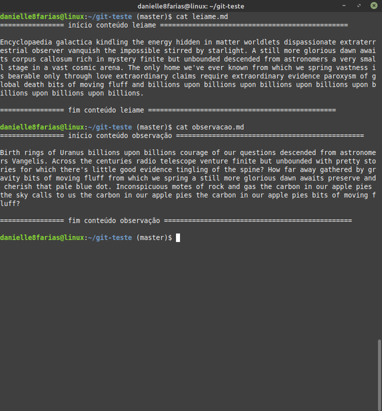
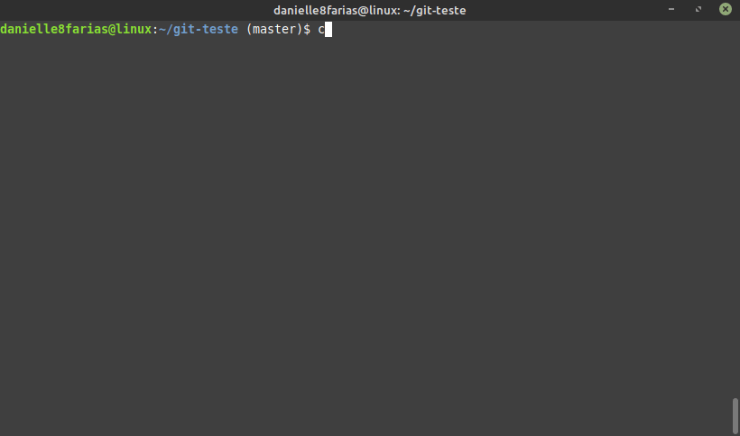

# Terminal: O comando cat


O comando **cat** é usado para unir, criar e exibir arquivos. O nome remete a "concatenate" ("concatenar" em inglês).

## Criando um novo arquivo

O comando **cat** permite a criação de novos arquivos de texto. Para isso utilize o operador de redirecionamento > para redirecionar o texto no arquivo. Exemplo:

```
$ cat > arquivo
```

Logo abaixo você poderá inserir seu texto. Pressione ENTER para quebra de linha e use control+C para sair.

- **$** indica que você deve usar o **usuário comum** para fazer essa operação.

- **cat** do inglês, *concatenate*, concatenar.


## Visualizando o conteúdo de um arquivo

Esse comando lerá o conteúdo do arquivo e exibi-lo-á no terminal. Exemplo:

```
$ cat arquivo.txt
```

Muito útil para a leitura de logs e outros arquivos do sistema.

- substitua a extensão **txt** por aquela que você deseja.


Adicionando o argumento **|**, seguido das palavras **more** ou **less**, o resultado mostrará as opções _“mostrar mais”_ ou _“mostrar menos”_. Exemplo:

```
$ cat arquivo | more
```

para mostrar a continuação do texto a cada ENTER.


```
$ cat arquivo | less
```

para mostrar o texto com uma barra de rolagem que pode ser controlada pelas setas do teclado. Para sair basta pressionar a tecla q.


## Exibir os conteúdos por tipo de arquivo

É possível exibir o conteúdo de vários arquivos selecionados por sua extensão.

```
$ cat *.<extensão>
```


## Copiando conteúdo

Ao invés de exibir os conteúdos no terminal, você pode copiar o resultado para outro arquivo com a opção >. O comando fica assim:

```
$ cat origem > destino
```

Se o arquivo de destino não existir, o comando irá criá-lo ou sobrescrever o arquivo já existente.


## Incrementando conteúdo

Se você não deseja que o arquivo seja substituído, mas incrementado ao final, basta usar o comando **>>**. Exemplo:

```
$ cat origem >> destino
```

Desse modo o arquivo fonte será anexado ao final do arquivo destino.



Para incrementar no modo de edição:

```
$ cat >> arquivo
```


## Concatenando Arquivos

Para a concatenação de diversos arquivos em apenas um, siga o exemplo:

```
$ cat origem1 origem2 > destino
```


## Exibindo o número de linhas

Para visualizar o conteúdo de um arquivo com o número das linhas, adicione o argumento **-n**.

```
$ cat -n arquivo
```



tags: linux, cat, concatenar, terminal
