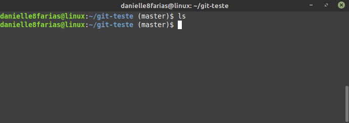
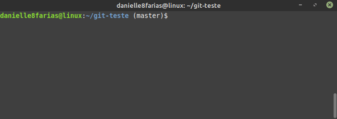
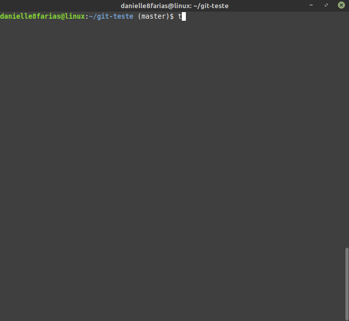
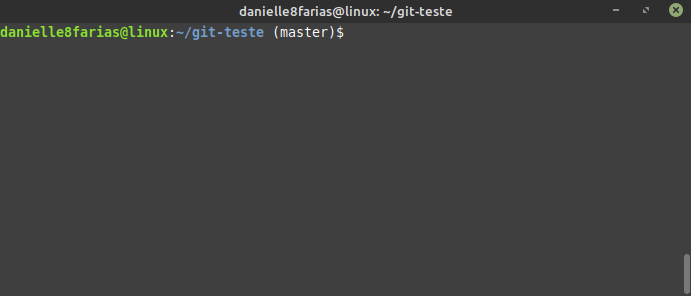
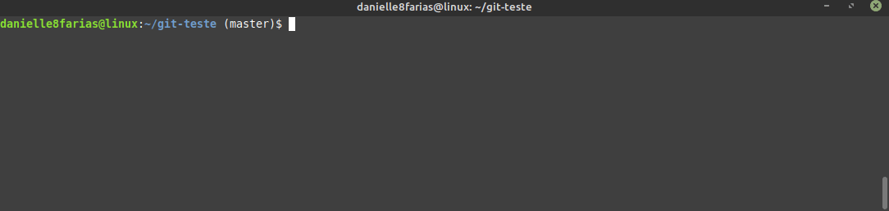

# Terminal: Criando arquivo


Um comando muito utilizado para criar arquivos(em branco) no Linux é o **touch**.

```
$ touch <arquivo>
```

- **$** indica que você deve usar o **usuário comum** para fazer essa operação.

- digite o nome que deseja dar ao arquivo sem os sinais **< >**.



## Criando mais de um arquivo simultaneamente

É possível criar mais de um arquivo por vez.

```
$ touch arquivo1 arquivo2 arquivo3
```



## Criando arquivo dentro de um diretório específico

Para criar arquivo dentro de um diretório específico, digite o caminho do diretório seguido do nome do arquivo.

Exemplo:

```
$ touch /home/usuario/Documentos/arquivo1.txt
```

No exemplo acima foi especificada a extensão do arquivo.



## Criando mais de um arquivo numerado

Outra maneira de criar três diretórios de uma vez, como o mostrado acima, em que só mudamos o número final do arquivo, é usando o recurso curinga. Assim, temos:

```
$ touch arquivo{1,2,3}
```

Depois do nome do arquivo, entre as chaves, colocamos o que há de diferente entre eles, no caso o final.



## Alterando data de criação de um arquivo

Ao utilizar o comando touch num arquivo já existente, o mesmo irá alterar a data da criação do arquivo para a data atual.



tags: linux, touch, criar, arquivos
