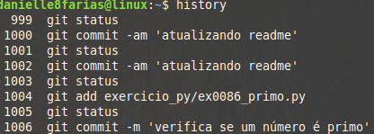
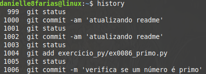

# Terminal: Histórico de comandos


Para buscar comando que já foram digitados no bash, basta pressionar a tecla ***seta para cima***, assim os comando do mais recente ao mais antigo poderão ser selecionados novamente, sem a necessidade de escrevê-los de novo.

Outra maneira de verificar os comando já digitados é através do comando:

```
$ history
```

O qual trará uma lista dos comandos já utilizados.

- **$** indica que você deve usar o **usuário comum** para fazer essa operação.

Caso deseje limpar o histórico armazenado, basta digitar:

```
$ history -c
```

Também é possível acessar o histórico de comando através do ***reverse search***. Para ativá-lo basta pressionar **CTRL+R** no terminal.


Assim, só é preciso digitar parte do comando ao qual se busca e o bash retornará alguma sugestão do histórico. Apertando **ENTER**, o comando é acionado.

Caso o comando que aparece não seja o desejado, pressione novamente **CTRL+R** quantas vezes forem necessárias, até encontrar o comando.

Para cancelar o reverse search basta pressionar **CTRL+C** e você retornará a visualização anterior.

Se você deseja exibir a data e hora em que os comandos foram usados, será necessário editar o arquivo **.bashrc**; assim:

No diretório do seu usuário, digite: 

```
$ nano .bashrc
```

Caso você não esteja no diretório, basta passar o caminho absoluto para chegar até ele; assim:

```
$ nano /home/seu_usuario/.bashrc
```

Aqui eu estou usando o editor **nano**, mas você pode usar aquele que preferir.

No final do documento, digite:

```
export HISTTIMEFORMAT="%d/%m/%y %T " && history
```

Desse modo, o histórico que antes aparecia assim,



Aparecerá assim,



tags: historico, comandos, linux, terminal
