# Terminal: Buscando arquivo/diretórios


As vezes gostaríamos de buscar um arquivo e/ou diretório e não lembramos onde ele está, mas sabemos o nome ou parte do nome dele.

## Usando a referência global

O linux possui um recurso conhecido como **curinga ou referência global**; é através dele que poderemos fazer as nossas buscas. Por exemplo:

```
$ ls /home/*.py
```

O comando **ls** vai listar o conteúdo do diretório indicado e retornará apenas os arquivos com a extensão **.py**, independente do nome do arquivo.

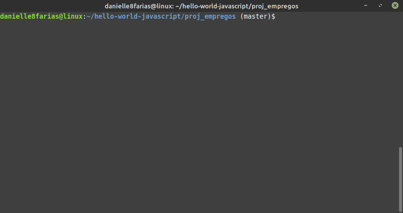

## Buscando por arquivo que contenham uma determinada letra

Se quisermos listar os arquivos que contenham uma determinada letra ou conjunto de letras no meio. Exemplo:

```
$ ls /home/*re*
```

Se o diretório tiver a(s) letra(s) referenciadas, ele retornará também o **conteúdo contido** nele.

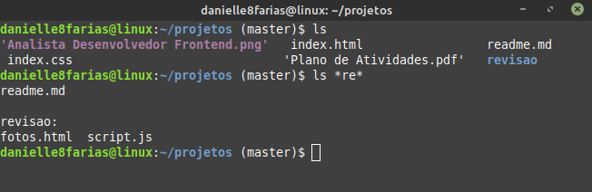

## Buscando por arquivo que comece com

Para listar os arquivos que comecem com uma determinada letra, usamos, por exemplo

```
$ ls /home/s*
```

Aqui serão listados os arquivos e pastas que comecem com a letra **s**.

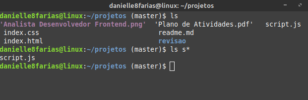

Se eu quiser arquivo e/ou diretórios que comecem com **a** ou **p**:

```
$ ls /home/[a,p]*
```

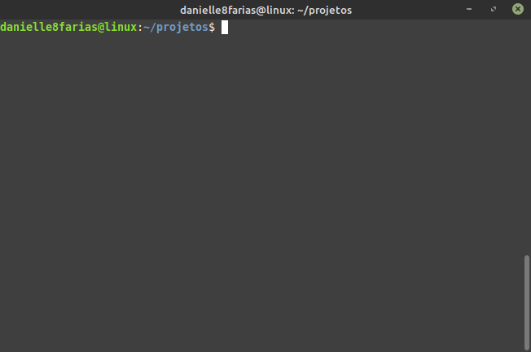

É importante notar que o sistema Linux faz distinção entre caracteres maiúsculos e minúsculos.

## Buscando por arquivo que termine com

Caso queira arquivos que terminem com uma determinada letra

```
$ ls /home/*f
```

Aqui o retorno será arquivos e/ou diretórios que terminam com a letra **f**. É importante notar que isso inclui também as letras da extensão do arquivo.

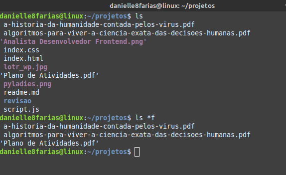

Para buscar arquivos que terminem com uma sequência de caracteres; exemplo:

```
$ ls /home/*{pdf,png}
```

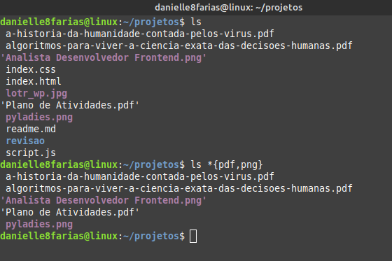

## Buscando por arquivo que possua um determinado caractere em um posição específica

Outra possibilidade é se quisermos buscar um arquivo que possua um ou mais caracteres em determinada posição. Exemplo:

```
$ ls /home/??a*
```

O comando acima pede que retorne arquivos ou pastas com a letra **a** na **terceira** posição (os dois pontos de interrogação) independente da terminação do nome do arquivo (asterisco ao final).

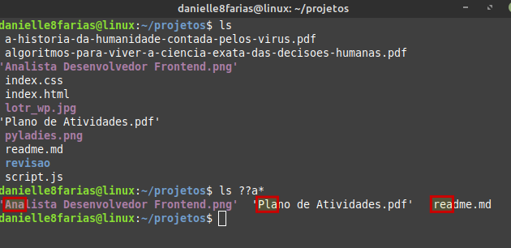

## Buscando arquivo com caracteres especificados

Para buscar arquivos dentro de uma faixa de caracteres. Exemplo:

```
$ ls /home/a[i-o]*
```

Aqui temos o retorno dos arquivos que começam com **a** seguidos das letras **i** ou **j** ou **k** e assim por diante até a letra **o** (o traço indica o intervalo), com quaisquer terminações (asterisco).

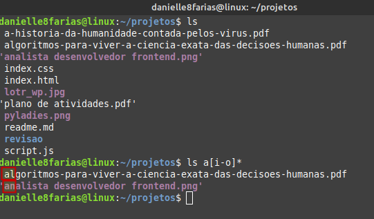

Outra maneira é

```
$ ls /home/a[n,o]*
```

Nesse caso, a vírgula indica para retornar com a segunda letra sendo **n** ou **o**.

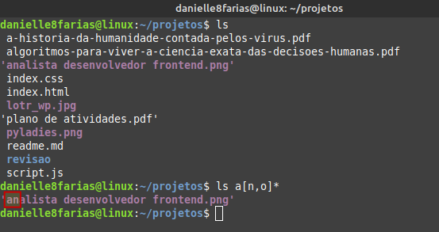

Ou ainda,

```
$ ls /home/*[x-z]*
```

O retorno será todos os arquivos que possuem da letra **x** até a letra **z** em quaisquer posições.

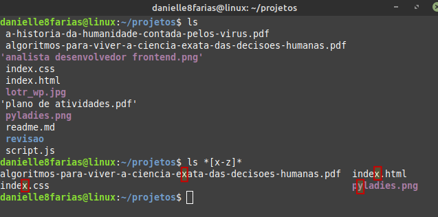

Caso queira que seu arquivo ou diretório tenha como segundo caractere uma vogal:

```
$ ls /home/?[a,e,i,o,u]*
```

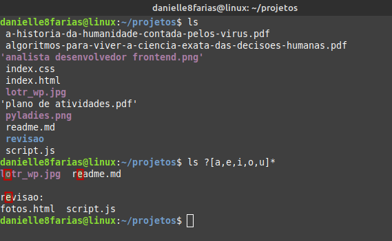

Lembrando que, se o diretório tiver a(s) letra(s) referenciadas, ele retornará também o **conteúdo contido** nele; como aconteceu com a pasta *revisao*.

Essa faixa também pode ser de números. Exemplo:

```
$ ls /home/?[0-9]*
```

Acima teremos o retorno de arquivos em que o segundo caractere é um número variando de **0** a **9**, seguido de qualquer terminação.

## Buscando arquivo com um número n de letras

Se quiser que o segundo caractere seja a letra **s** numa palavra de cinco letras:

```
$ ls /home/?s???
```

Uma palavra de seis caracteres, em que o segundo seja uma vogal seguida de **s**.

```
$ ls /home/?[a,e,i,o,u]s???
```

## Buscando por duas extensões ao mesmo tempo

Se a minha busca é de duas extensões de arquivos ao mesmo tempo, temos:

```
$ ls /home/*.{conf,db}
```

Nesse caso, eu quero arquivos com qualquer nome, mas que tenham as extensões **.conf** e **.db**.

É possível fazer várias combinações entre esse recurso para atender ao que você deseja.

Lembre-se que letras maiúsculas e minúsculas são caracteres diferentes aqui (case-sensitive).

tags: linux, busca, curinga, referencia global
