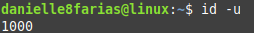

# Terminal: Informações sobre o usuário

Para verificar seu nome de usuário, digite no terminal: 

```
$ whoami
```

- **$** indica que você deve usar o **usuário comum** para fazer essa operação.

- **whoami** comando que identifica o usuário.


Para verificar os usuários que estão conectados a máquina.

```
$ who
```

- **who** retorna quem está logado na máquina

É possível estar conectado e não ser o usuário (no caso de servidores).


Para verificar os dados do usuário e os grupos o qual ele faz parte, digite:

```
$ id
```


Com o argumento **-u** temos o número de identificação do usuário atual.

```
$ id -u
```



Com o argumento **-un** temos apenas o nome do usuário atual.

```
$ id -un
```


Para saber a quais grupos o usuário atual pertence, digite:

```
$ groups
```


Para saber a quais grupos um determinado usuário pertence, digite:

```
$ groups <nome_do_usuário>
```

- digite o nome do usuário sem os sinais **< >**.

tags: who, whoami, linux, terminal
