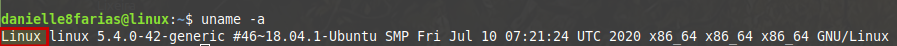
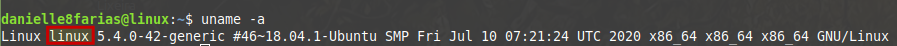
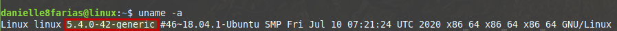
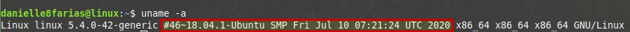
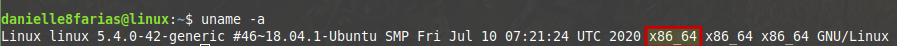
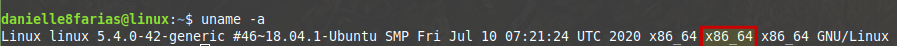
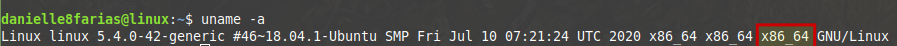
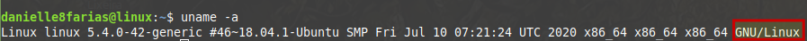

# Terminal: Verificando informações do sistema


O comando:

```
$ uname -a
```

retorna **informações referentes ao sistema**.

- **$** indica que você deve usar o **usuário comum** para fazer essa operação.

- **-a** do inglês, *all*, para retornar todas as informações.

No meu caso, temos o seguinte retorno:

```
Linux linux 5.4.0-42-generic #46~18.04.1-Ubuntu SMP Fri Jul 10 07:21:24 UTC 2020 x86_64 x86_64 x86_64 GNU/Linux
```



O primeiro item é o **nome do Kernel** do sistema. Para que seja mostrado na tela apenas ele, digite:

```
$ uname -s
```

Ou

```
$ uname
```

Sem qualquer argumento.



O segundo item é o **nome da máquina**, dado no momento da instalação. Para que seja mostrado na tela apenas ele, digite:

```
$ uname -n
```



O terceiro item é a **versão de lançamento do Kernel**. Para que seja mostrado na tela apenas ele, digite:

```
$ uname -r
```



O quarto item é a **versão atual do Kernel**. Para que seja mostrado na tela apenas ele, digite:

```
$ uname -v
```



O quinto item é a **arquitetura de hardware da máquina**. Para que seja mostrado apenas ela na tela, digite:

```
$ uname -m
```



O sexto item é o **tipo de processador**. Para que seja mostrado apenas ele na tela, digite:

```
$ uname -p
```



O sétimo item é a **plataforma de hardware**. Para que seja mostrado apenas ela na tela, digite:

```
$ uname -i
```



O oitavo e último item é nome do **sistema operacional** da instalado. Para que seja mostrado apenas ele na tela, digite:

```
$ uname -o
```

tags: linux, terminal, uname
