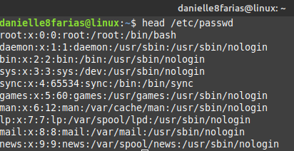
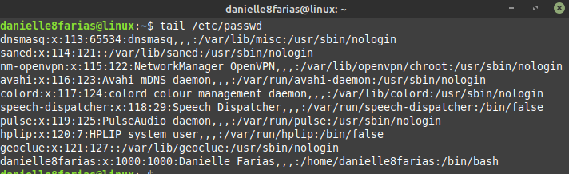
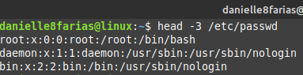
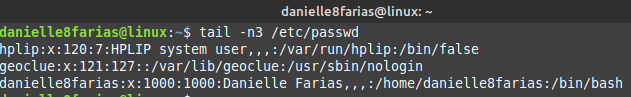
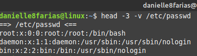
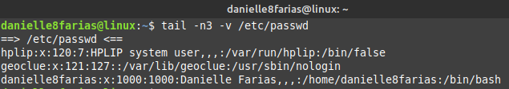
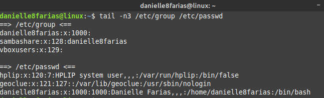

# Terminal: Mostrando o início ou fim de um arquivo texto


Usamos o comando **head** para mostrar no terminal o conteúdo do início de um arquivo de texto e o comando **tail** para mostrar o final. Por padrão, ambos mostram 10 linhas do arquivo.

```
$ head <nome_do_arquivo_texto>
```

- **$** indica que você deve usar o **usuário comum** para fazer essa operação.

- **head** retorna no terminal as 10 primeiras linhas de um arquivo de texto indicado.

- digite o nome do arquivo de texto sem os sinais **< >**.



```
$ tail <nome_do_arquivo_texto>
```

- **tail** retorna no terminal as 10 últimas linhas de um arquivo de texto indicado.



## Mostrando um número n de linhas

Caso queira mostrar um determinado número de linhas, digite:

```
$ head -n <nome_do_arquivo_texto>
```

- **-n** é o número de linhas que você deseja que seja mostrado.

```
$ tail -n<número> <nome_do_arquivo_texto>
```

Exemplos:





## Cabeçalho dos arquivos

Para que, ao ler o arquivo, mostre o caminho até ele, digite

```
$ tail -v <nome_do_arquivo_texto>
```

Exemplos:

Mostrando o caminho e 3 primeiras linhas de um arquivo.



Mostrando o caminho e 3 últimas linhas de um arquivo.



## Mostrando mais de um arquivo ao mesmo tempo

Para mostrar as primeiras linhas de mais de um arquivo ao mesmo tempo, digite:

```
$ head <arquivo_de_texto_1> <arquivo_de_texto_2>
```

Ou para mostrar as últimas linhas de mais de um arquivo ao mesmo tempo,

```
$ tail <arquivo_de_texto_1> <arquivo_de_texto_2>
```

Exemplo:

Mostrando as 3 últimas linhas dos arquivos group e passwd



## Mostrando as últimas linhas em tempo real

Para mostrar as últimas linhas de um arquivo dinâmicamente

```
$ tail -f <nome_arquivo_texto>
```

Exemplo:

```
$ tail -f /var/log/messages
```

Para voltar ao terminal, digite **Ctrl** + **C**.

tags: linux, tail, head, terminal
