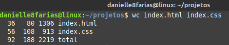
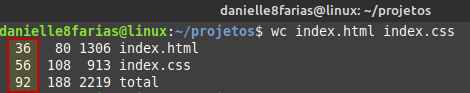
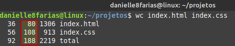
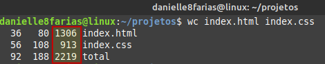
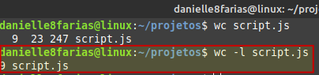
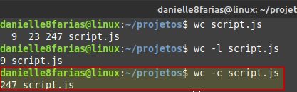
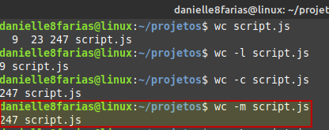
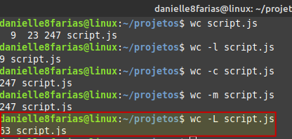
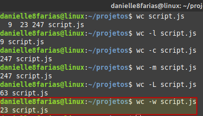

# Terminal: Contando palavras em um arquivo


```
$ wc <nome_do_arquivo>
```

- **$** indica que você deve usar o **usuário comum** para fazer essa operação.

- **wc** do inglês, word count, é o comando usado para contar palavras, bytes, linhas e caracteres.

- digite o nome do arquivo sem os sinais **< >**.

Exemplo: Usando o comando **wc** em dois arquivos.



A **primeira coluna** conta as **linhas**, 



A **segunda coluna** conta as **palavras**,



E a **terceira coluna** os **caracteres**.



## Contando as linhas

```
$ wc -l <nome_do_arquivo>
```

- **-l** mostra o número de linhas.



## Contando os bytes

```
$ wc -c <nome_do_arquivo>
```

- **-c** mostra o número de bytes.



## Contando os caracteres

```
$ wc -m <nome_de_arquivo>
```

- **-m** mostra o número de caracteres.



As versões antigas do **wc** não fazem diferença entre bytes e caracteres.

## Maior linha

```
$ wc -L <nome_do_arquivo>
```

- **-L** mostra o tamanho da maior linha.



## Contando as palavras

```
$ wc -w <nome_do_arquivo>
```

- **-w** mostra o número de palavras.



tags: linux, terminal, wc
