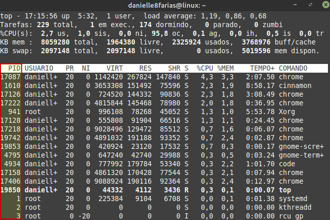
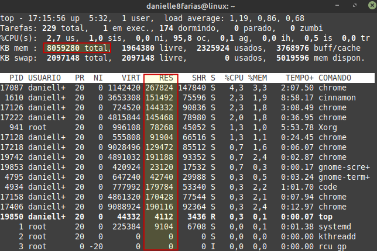

# Terminal: Visualizando processos


Para visualizar os processos do sistema, digite:

```
$ top
```

- **$** indica que você deve usar o **usuário comum** para fazer essa operação.


Esses processos são mostrados em tempo real.

> Os processos são todos os programas que estão rodando no sistema, inclusive aqueles que fazem o S.O. funcionar.

Para ordenad por CPU, pressione **Shift + p**. Para ordenar por memória, pressione **Shift + m**. **Shift + t** ordena pelo tempo. Com **shift + f** é possível selecionar quais campos gostaria de ver no top.

Para voltar ao shell, pressione **q**.

As informações que o comando **top** traz, são:

## 1. Linha top:

**1.1.** O **horário atual** do sistema no formato **horas:minutos:segundos**:


**1.2.** O **tempo** que o sistema está **ligado**:


**1.3. Quantidade** de **usuários** conectados ao sistema:


**1.4.** A **média de carga de trabalho**:


Esse número são obtidos tomando como base o número de núcleos do processador da sua máquina.

No exemplo mostrado acima, temos que, em média, no **último minuto** existiam **0,94 processos** rodando ou esperando por recursos do sistema, ou seja, 0,94 de 4 (que no caso é o número de núcleos da máquina utilizada no exemplo). Enquanto nos últimos **5 minutos** existiam **0,74**. E nos últimos **15**, existiam **0,72**. 

## 2. Linha tarefas:

**2.1. Total de tarefas** no sistema:


**2.2.** Total de **tarefas em processamento**:


**2.3. Processos modo de espera**: 


São os processos que estão em uso pelo sistema, mas que não estão em processamento no momento atual.

**2.4.** Total de **tarefas paradas**:


**2.5.** Total de **tarefas em modo zumbi**:


São processos que não existem mais no sistema, mas que por algum motivo ainda permanecem na listados (geralmente por erros no software, processos finalizados de maneira abrupta, entre outros).

## 3. Linha CPU(s):

**3.1.** Porcentagem de uso de CPU** por processos do **usuários**:


**3.2. Porcentagem de uso de CPU** por processos do **Kernel(núcleo do sistema)**:


**3.3. Porcentagem de uso de CPU** de processos que tiveram sua **prioridade modificada** pelos comandos **nice ou renice**:


O comando **nice** serve para redefinir a prioridade de um determinado processo. O comando **renice** altera a prioridade de um processo que já está em execução.

**3.4.** Porcentagem da **CPU livre para uso**:


**3.5.** Porcentagem de **uso da CPU em operações de entrada e saída**:


**3.6.** Porcentagem de **uso da CPU por interrupções do hardware**:


**3.7.** Porcentagem de **uso da CPU utilizada por interrupções de software**:


**3.8.** Porcentagem de **uso da CPU para máquinas virtuais**:


## 4. Linha KB mem:

**4.1. Memória RAM total** da máquina:


**4.2. Memória RAM livre**:


**4.3. Memória RAM usada**:


**4.4. Memória cache** utilizada:


A memória cache tem por função armazenar dados e instruções que a CPU pode precisar em breve.

## 5. Linha KB swap:

A **memória swap** é aquela **área do HD** que pode ser usada de **maneira complementar** à **memória RAM**.


**5.1. Memória disponível**:


É a memória livre para inicialização dos programas, sem utilizar a swap.

## 6. PID:



É a identificação única de um determinado processo.

## 7. USUARIO:

A quem pertence um determinado processo.

## 8. PR:

A prioridade de uma determinada tarefa.

## 9. NI:

Um valor **nice negativo** implica **maior prioridade**, enquanto um valor **nice positivo** significa **menor prioridade** do processo.

## 10. VIRT:

São todas as memórias que estão sendo utilizadas para um determinado processo e suas dependências, bibliotecas, etc.

## 11. RES:

É a memória residente; memória RAM utilizada por um determinado processo.

## 12. SHR:

Quanto da memória usada por um determinado processo é compartilhável.

## 13. S:

É o estado de um processo. S dormindo. R rodando. Z zumbi. I ocioso.

## 14. CPU:

Porcentagem da CPU utilizada de um determinado processo.

## 15. MEM:

Memória residente dividida pela memória total.



## 16. TEMPO:

Quanto tempo de uso desde da última inicialização do sistema.


tags: linux, terminal, top, htop
