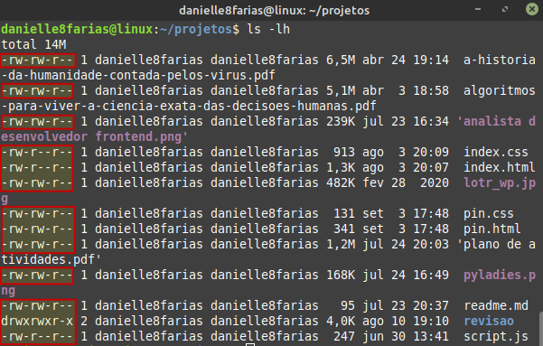
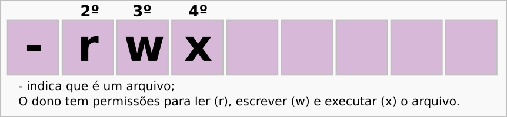
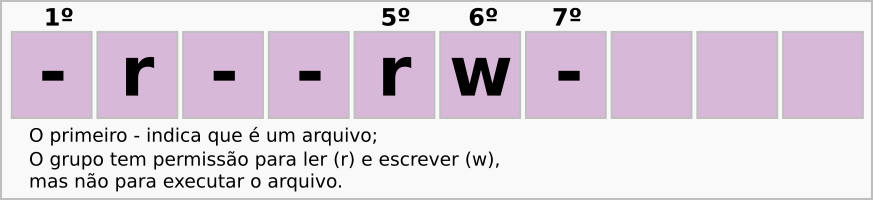

# Terminal: O sistema de permissões no Linux

O sistema de permissão no Linux dá possibilidade de alterar três propriedades de arquivos e diretórios. São elas:

## Leitura (R - read)

Se os usuários podem abrir um arquivo e fazer a leitura do conteúdo deste.

## Escrita (W - write)

Se os usuários podem alterar esse arquivo.

## Execução (X - execute)

Se os usuários podem executar esse arquivo.

## Interpretando as permissões

As permissões são descritas com uma sequência de 10 caracteres.

- O primeiro item é referente ao **diretório ou arquivo**:

- O segundo, terceiro e quarto itens são referentes as permissões do **dono** do arquivo:

- O quinto, sexto e sétimo itens são referentes as permissões do **grupo** ao qual o arquivo pertence:

- 