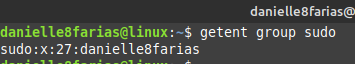
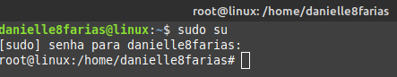
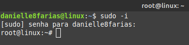
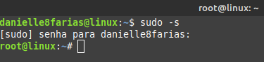

# Terminal: Entendendo o sudo e o root


## Root

No Linux, o **super usuário (root)** é equivalente ao **Administrador** no **Windows**.

O **root** tem permissão para fazer de tudo, inclusive destruir o sistema. Sendo assim, trabalhar diariamente como super-usuário pode ser perigoso, principalmente para os menos experientes.

## Sudo

Usamos o comando **sudo** para executar tarefas com privilégios de outro usuário, geralmente é usado para obter os privilégios do **super usuário (root)**, que é aquele que tem permissão para modificar todo o sistema.

```
$ sudo
```

O Sudo pode ter dois significados:

- **super user do**, para tarefas como root;
- **substitute user do**, para tarefas com privilégios de outros usuários comuns.

A distro (distribuição Linux) Ubuntu, e seus derivados (Elementary OS, Mint,ZorinOs, etc), vêm com o **sudo** ao invés do **root**. Por padrão, a senha do root é travada, como uma camada se segurança.

Isso significa que você não pode fazer login como root ou usar o comando ```su```. Entretanto, na instalação do sistema, o instalador irá configurar o comando **sudo** para o usuário recém criado.

O sudo, ao ser invocado, permite que os usuários dentro do **grupo sudo** tenham **pivilegios administrativos**.



- **$** indica que você deve usar o **usuário comum** para fazer essa operação.

- **getent** é o comando obtem informações de arquivos de texto, como **passwd** e **group**.

- **group** é o nome do arquivo que queremos extrair a informação.

- **sudo**, nesse caso, é a informação que queremos obter do comando **getent**.

> para saber mais sobre grupos, no Linux, [clique aqui.](p0028_groups.md)

## Obtendo privilégios de super usuário

Os comandos 

```
$ sudo su
```

ou

```
$ sudo -i
```

ou ainda

```
$ sudo -s
```

indica que seu usuário vai ter, a partir de agora, **privilégios administrativos**, como o **root**. A **senha** que será pedida para a execução desse comando é aquela do **usuário logado**.

- **su**, do inglês switch user, é o comando que executa a troca de usuário.



- **-i** é o comando que faz uma simulação do login inicial.



- **-s** referece ao shell, ou seja,o terminal será executado com privilégios de **root**.



Para **voltar ao usuário comum**, digite no terminal:

```
# exit
```

- **#** indica que você tem permissões de **super usuário** ao fazer essa operação.

## Dando poderes a outro usuário

Para que um outro usuário também possa ter privilégios de super usuário, digite:

```
$ sudo usermod -aG sudo <nome_do_usuário>
```

- **sudo**, para invocar os privilégios de root;

- **usermod**, adiciona ou modifica informações de um usuário já existente no sistema.

- **aG**, **a** para adicionar e **G** para grupo.

- **sudo**, esse é o nome do grupo ao qual queremos que o novo usuário faça parte.

- digite o nome do usuário sem os sinais **< >**.

tags: linux, terminal, sudo, root
