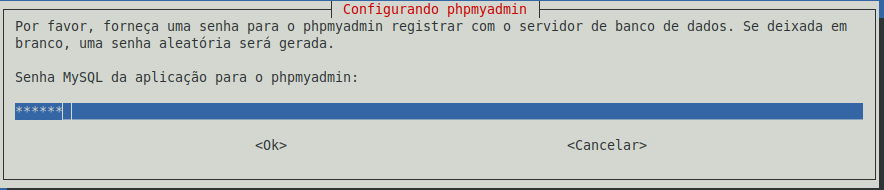

# Instalação e configuração LAMP (Linux, Apache, MariaDB e PHP) no Linux (Ubuntu e derivados)


Antes de começarmos precisamos atualizar o sistema.

> [saiba como atualizar seu Linux aqui.](p0005_update.md)

## Apache

Em seguida, vamos a instalação do servidor web Apache:

```
$ sudo apt install apache2
```

- **$** indica que você deve usar o **usuário comum** para fazer essa operação.

- **sudo** serve para pedir permissões de administrador temporariamente.

- **apt** do inglês, *Advanced Package Tool*, em português, Ferramenta de Empacotamento Avançada; é a ferramenta que nos ajuda na instalação, atualização e desinstalação de programas, entre outras funções.

- **install** é o comando de instalar, indicando ao apt o que fazer.

## Verificando a instalação do Apache

Para verificar se a instalação foi correta, você pode digitar no terminal:

```
$ systemctl status apache2
```

- **systemctl** é o comando para habilitar, desabilitar, reiniciar, verificar o estado de um serviço, entre outras funções.

- **status** é o parâmetro que passamos ao comando systemctl para verificar o estado de um serviço (no nosso caso, o Apache).

A saída do comando deve ser algo como:


Para sair dessa tela, pressione **q**.

Outra maneira de verificar a instalação do Apache é abrindo o navegador e digitando na barra de endereço ```127.0.0.1``` ou ```localhost```.

A tela de retorno será:


Se nenhuma dessas telas aparecer para você, pode ser que você precise iniciar o Apache manualmente através do comando:

```
$ sudo systemctl start apache2
```

- **start** é o parâmetro que passamos ao comando systemctl para iniciar um serviço (no nosso caso, o Apache).

## Iniciando o Apache com o sistema

Caso você queira iniciar o Apache junto com o sistema operacional no próximo boot, digite:

```
$ sudo systemctl enable apache2
```

- **enable** é o parâmetro que passamos ao comando systemctl para iniciar automaticamente o Apache ao iniciar o sistema.

## Verificando a versão do Apache

Para verificar a versão do Apache instalada no seu sistema, digite:

```
$ apache2 -v
```

- **-v** do inglês, *version*, vai retornar na tela a versão instalada.

## MariaDB

Agora vamos instalar o servidor de banco de dados:

```
$ sudo apt install mariadb-server
```

- **mariadb-server** é o nome do pacote do serviço de banco de dados que vamos instalar.

## Verificando a instalação do MariaDB

Para verificar se o serviço do banco de dados já foi iniciado, digite no terminal:

```
$ systemctl status mariadb
```

O retorno será:


Se o serviço não estiver ativo, pode ser que você precise iniciar o MariaDB manualmente através do comando:

```
$ sudo systemctl start mariadb
```

## Iniciando o MariaDB com o sistema

Caso você queira iniciar o MariaDB junto com o sistema operacional no próximo boot, digite:

```
$ sudo systemctl enable mariadb
```

## Configurando o MariaDB

No terminal digite:

```
$ sudo mysql_secure_installation
```

A seguinte tela será mostrada:


Como ainda não temos senha para o root do MariaDB, pressionamos **ENTER**. Em seguida pressione y para cadastrar uma senha para o root:


Definimos a senha e a repetimos em seguida para confirmação.

Nas perguntas seguintes, eu respondi sim (**y**) para todas as perguntas, mas você pode fazer diferente, de acordo com a sua necessidade.


Agora, vamos fazer o login no servidor de banco de dados:

```
$ sudo mysql
```

E criar um usuário administrador no MariaDB, que será usado para se com o **phpMyAdmin**.

No prompt do MariaDB, digite:

```
grant all privileges on *.* to <seu_usuario>@localhost identified by 'escolha_uma_senha';
```

- escolha um nome de usuário sem os sinais **< >**.

```
flush privileges;
```

e

```
exit
```

para sair.


## Verificando a versão do MariaDB

Para verificar a versão do MariaDB instalada no seu sistema, digite:

```
$ mariadb -V
```

## PHP

Agora vamos instalar o PHP e tudo o que for referente a ele para a conexão com os serviços.

```
$ sudo apt install php php-mysql php-mbstring libapache2-mod-php
```

- **php** é a linguagem de script;

- **php-mysql** é a ferramenta que faz a conexão da linguagem com o banco de dados;

- **php-mbstring** é a ferramenta usada para a conversão de strings; necessaria para a ligação com o phpMyAdmin;

- **libapache2-mod-php** é a ferramenta que faz a conexão com o Apache.

## Verificando a instalação do PHP

Vá até o diretório **/var/www/html/**,

```
$ cd /var/www/html/
```

- **cd** do inglês, *change directory*, serve para mudar de diretório/pasta.

> para saber mais sobre como navegar nos diretórios pelo terminal, [clique aqui](p0004_cd.md).

E crie o arquivo **info.php**:

```
$ sudo nano info.php
```

- aqui precisamos invocar o **sudo** porque um usuário comum não tem permissão para escrever nesse diretório;

> para saber sobre o sistema de permissões de diretórios do Linux, [clique aqui](p0031_permissoes.md).

- estou utilizando o editor **nano**, mas você pode usar outro que preferir.

Dentro do arquivo escreva:

```php
<?php
phpinfo();
```
E salve o documento.

Na barra de endereço do navegador, digite ```localhost/info.php```

Se estiver tudo certo, veremos a tela a seguir


## Verificando a versão do PHP

Para verificar a versão do PHP instalada no seu sistema, digite:

```
$ php -v
```

## phpMyAdmin

Retorne a sua home com o comando

```
$ cd
```

Agora vamos fazer a instalação da ferramenta que vai fazer a administração do nosso servidor de banco de dados MariaDB.

```
$ sudo apt install phpmyadmin
```

A seguinte tela será apresentada:


## Configurando o phpMyAdmin

Vá com a seta até a opção **apache2** e pressione a tecla de **espaço** para marcá-la.


Pressione **TAB** para ir até botão **OK** e pressione **ENTER**.


Na tela seguinte você deve pressionar **ENTER** na opção **sim** para configurar o bando de dados para o phpMyAdmin.


Em seguida será pedido a criação de uma senha para o usuário padrão da aplicação (phpmyadmin) e a confirmação dela.




## Verificando a instalação do phpMyAdmin

Na barra de endereço do navegador, digite ```localhost/phpmyadmin```

Ao entrar com o login **phpmyadmin** e a senha que fizemos há pouco,


E ao clicar em banco de dados, podemos perceber que não temos permissão para criar um novo banco.


Porém, ao inserirmos o usuário que criamos no prompt do MariaDB, vemos que temos esse privilégio:


LAMP configurado e pronto para ser usado! =)

tags: lamp, php, apache, mariadb
