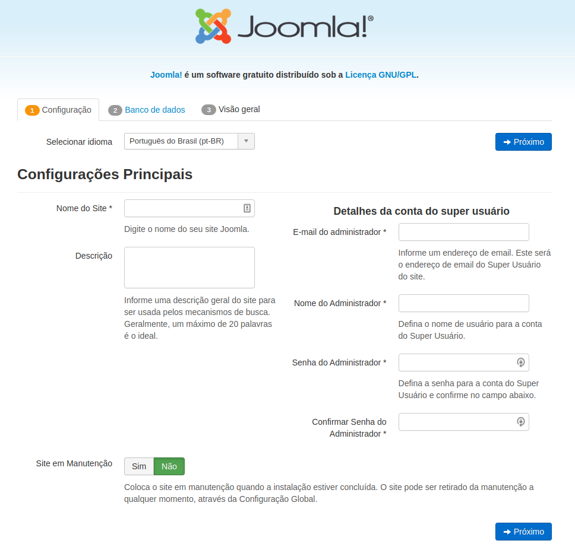
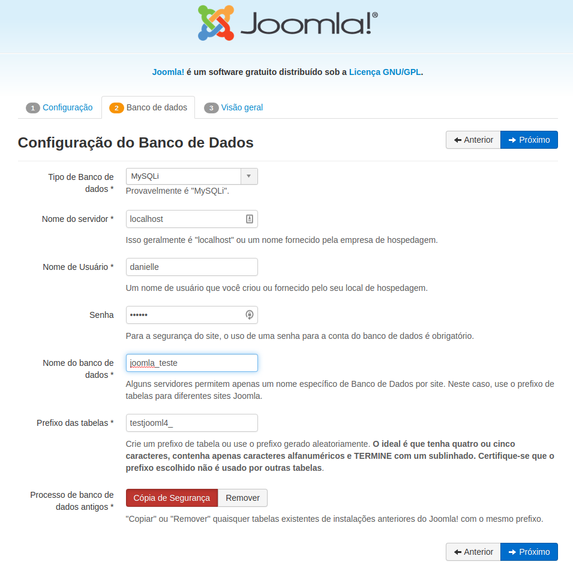
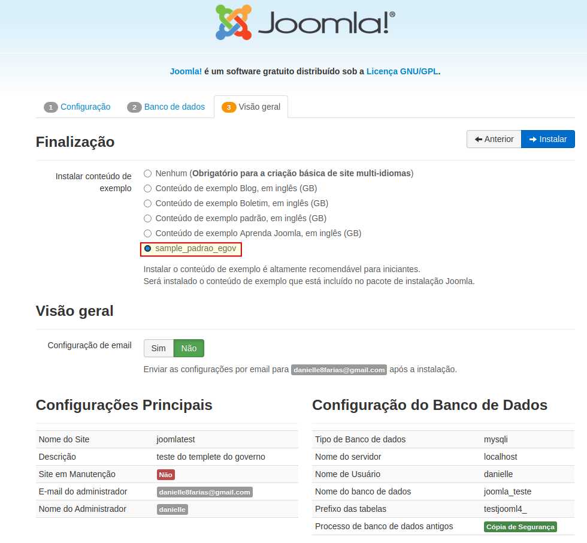
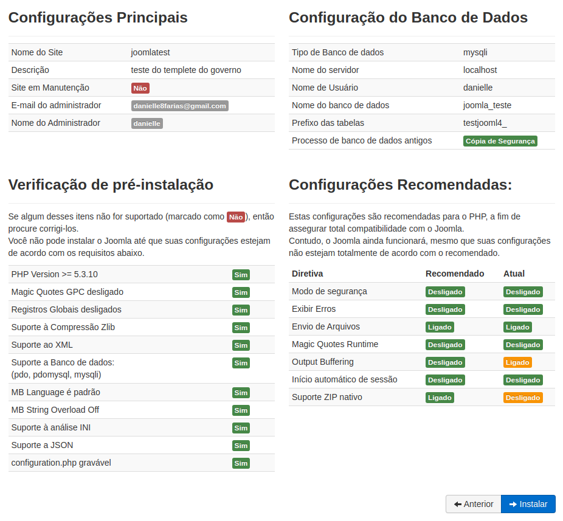
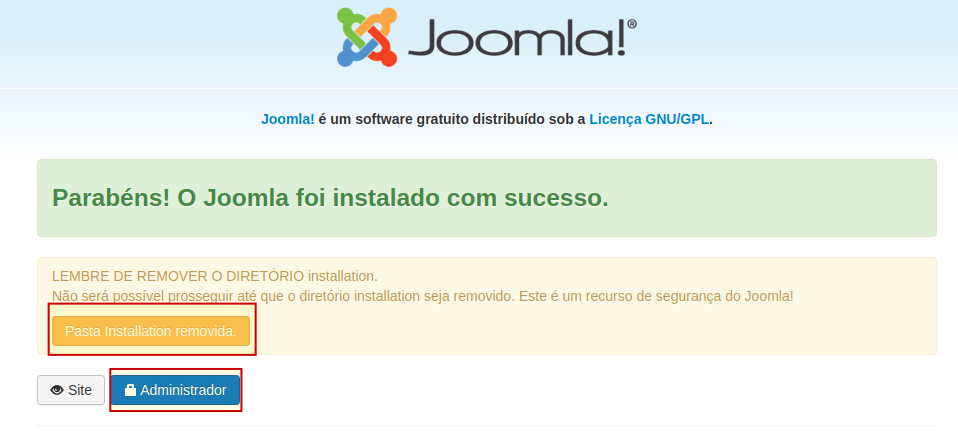

# Instalação do Joomla-3.x no Linux (Ubuntu e derivados)


**Atenção!** Esse é um tutorial para um fork do governo federal. 

Antes de instalação do Joomla, é preciso configurar o ambiente **LAMP** e ter o **Git** instalado. 

> [clique aqui](p0034_lamp.md) para saber sobre a configuração LAMP.

> para saber como instalar o git, [clique aqui](git/p0000_instalacao_git_linux.md).

```
$ git clone git@github.com:joomlagovbr/joomla-3.x.git
```

- **$** indica que você deve usar o **usuário comum** para fazer essa operação;

- **git** invocando o programa de versionamento;

- **clone** cria uma cópia do repositório remoto para a sua máquina.

> para saber mais sobre o comando git clone, [clique aqui](git/p0023_clone.md).

Agora, vamos **renomear o diretório** para facilitar a movimentação nele:

```
$ mv joomla-3.x/ joomla/
```

- **mv** do inglês, *move*, para mover um diretório; porém se essa ação for feita no mesmo local, o arquivo será **renomeado** ao invés de movido.

Em seguida, vamos **mover a pasta** clonada do git para o diretório raiz da instalação do Apache.

```
$ sudo mv joomla-3.x /var/www/html
```

- aqui é preciso invocar o **sudo** caso você não tenha as permissões de escrever no diretório.

- **mv** do inglês, move, para mover um arquivo.

> para saber mais sobre como renomear e mover arquivos e diretórios no Linux, [clique aqui](linux/p0022_mv.md).

> para saber mais sobre as permissões no Linux, [clique aqui](linux/p0031_permissoes.md).

Precisamos adicionar o seu usuário ao grupo **www-data**:

```
$ sudo gpasswd -a <seu_usuário> www-data
```

- **gpasswd** é comando que permite administrar o arquivo **/etc/group**, que é o arquivo que faz o gerenciamento dos grupos;

- **-a** para adicionar um novo usuário ao grupo.

> para saber mais sobre o sistema de grupos no Linux, [clique aqui](linux/p0028_groups.md).

E mudar o dono da pasta joomla e todos os arquivos dentro dela para o usuário **www-data** e grupo **www-data**:

```
$ sudo chown -R www-data:www-data /var/www/html/joomla
```

- **chown** do inglês, *change owner*, mudar de dono. 

- **-R** quer dizer recursivo; o comando anterior será feito não apenas no diretório indicado, mas em todos os arquivos e subdiretórios dentro dele.

Agora devemos mudar as permissões da pasta:

```
$ sudo chmod -R 755 /var/www/html/joomla
```

- **chmod** do inglês, *change mode*, altera as permissões de acesso de arquivos e diretórios.

- **755** usa a base octal para fazer as mudanças nas permissões. Aqui nesse caso, o diretório, subdiretórios e arquivos vão ficar com as seguintes permissões: **rwx r-x r-x**. O dono pode ler, escrever e executar os arquivos. O grupo e os outros usuários pode ler e executar os arquivos.

Em seguida vamos **reiniciar o Apache**:

```
$ sudo systemctl restart apache2
```

Abra o navegador e digite ```localhost/joomla``` para começar a instalação.

A tela que vai aparecer é a seguinte:



Preencha com os seus dados e siga para a próxima tela. Preencha também as configurações para o banco de dados e siga para a próxima tela.



Na aba três, será mostrado as configurações que você fez para esse ambiente. Marque a opção **sample_padrao_egov** para usar o template do governo federal.





Clique no botão para remover a pasta *installation* e em seguida entre com o nome do usuário e senha que você configurou anteriormente.



Se tudo estiver correto, a tela do site vai carregar com o template.


tags: joomla, template, governo, federal, configuração
