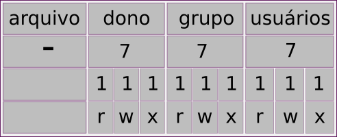
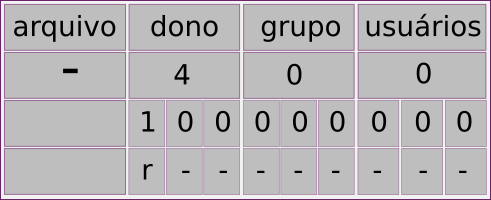
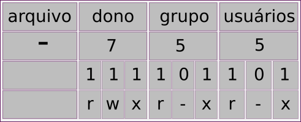
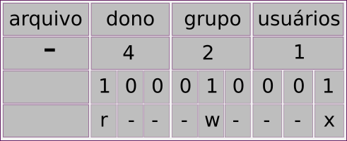

# Terminal: alterando permissões


## Modo numérico

```
$ sudo chmod <permissões> <nome_do_arquivo_ou_diretório>
```

- **$** indica que você deve usar o **usuário comum** para fazer essa operação.

- **sudo** serve para pedir permissões de administrador temporariamente.

- **chmod** do inglês, *change mode*, é o comando que altera as permissões de acesso aos objetos do sistema.

- **permissões** é substituído por um conjunto de 3 números (sem o uso dos sinais < >) que vão de 0 a 7, pois as alterações das permissões no modo numérico usa a base octal.

> recomendo a leitura sobre [base octal](../bases_numericas/p0002_base_numerica_oct.md) e [base binária](../bases_numericas/p0001_base_numerica_bin.md) antes de continuar.

- **nome** do diretório ou arquivo sem os sinais **< >**.

Vamos entender a lógica por trás desse modo de permissão:

Primeiro precisamos lembrar da **correspondência entre octal e binário**.

| binário | octal |
|---------|-------|
|   000   |   0   |
|   001   |   1   |
|   010   |   2   |
|   011   |   3   |
|   100   |   4   |
|   101   |   5   |
|   110   |   6   |
|   111   |   7   |

Lembrando que as permissões são descritas como uma sequência de 10 caracteres.

| diretório ou arquivo | dono do arquivo | grupo | usuário (outros) |
|----------------------|-----------------|-------|------------------|
|   **d** ou **-**     |      r w x      | r w x |     r w x        |

Em que,

- **r** = leitura (read);
- **w** = escrita (write);
- **x** = execução (execute).

Temos:

- **0: --- (sem permissão)**

| 0 | 0 | 0 |
|---|---|---|
| - | - | - |

- **1: --x (execução)**

| 0 | 0 | 1 |
|---|---|---|
| - | - | x |

- **2: -w- (escrita)**

| 0 | 1 | 0 |
|---|---|---|
| - | w | - |

- **3: -wx (escrita e execução)**

| 0 | 1 | 1 |
|---|---|---|
| - | w | x |

- **4: r-- (leitura)**

| 1 | 0 | 0 |
|---|---|---|
| r | - | - |

- **5: r-x (leitura e execução)**

| 1 | 0 | 1 |
|---|---|---|
| r | - | x |

- **6: r-x (leitura e escrita)**

| 1 | 1 | 0 |
|---|---|---|
| r | w | - |

- **7: rwx (leitura, escrita e execução)**

| 1 | 1 | 1 |
|---|---|---|
| r | w | x |

Exemplo 0:

```
$ sudo chmod 777 arquivo
```

Aqui temos **todas as permissões** para **todos os usuários e grupos** (evitar ao máximo usar o 777, pois pode deixar o sistema vulnerável a ataques).



Exemplo 1:

```
$ sudo chmod 400 arquivo
```

Aqui somente o **dono** tem permissão de **leitura**.



Exemplo 2:

```
$ sudo chmod 764 arquivo
```

Aqui o **dono** tem **todas as permissões**, o **grupo** pode **ler e alterar** o arquivo e os demais **usuários** podem apenas **ler**.


Exemplo 3:

```
$ sudo chmod 755 arquivo
```

Aqui o **dono** tem **todas as permissões**, o **grupo** e demais **usuários** podem **ler e executar** o arquivo.



Exemplo 4:

```
$ sudo chmod 421 arquivo
```

Aqui o **dono** tem permissão de **leitura**, o **grupo** tem permissão de **escrita** e os demais **usuários** podem apenas **executar** o arquivo.




tags: linux, terminal, alterar, permissões, modo numérico, 
