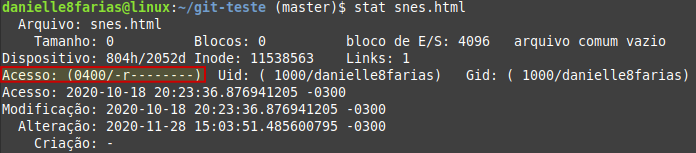
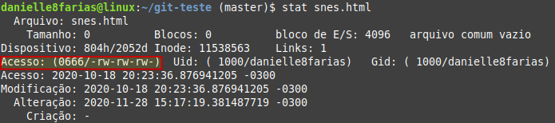
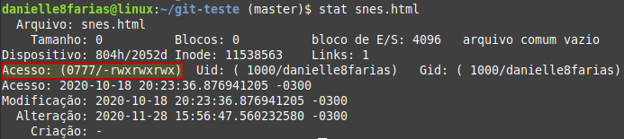
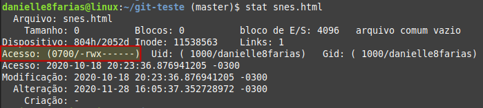

# Terminal: alterando permissões


## Modo simbólico

```
$ sudo chmod <argumentos> <nome_do_arquivo_ou_diretório>
```

- **$** indica que você deve usar o **usuário comum** para fazer essa operação.

- **sudo** serve para pedir permissões de administrador temporariamente.

- **chmod** do inglês, *change mode*, é o comando que altera as permissões de acesso aos objetos do sistema.

Os **argumentos** são:

- **+** adiciona uma permissão a outra já pré-existente.
- **-** remove uma permissão.
- **=** substitui uma permissão pré-existente.

- **u**: do inglês, *user*, referece ao dono do arquivo.
- **g**: do inglês, *group*, referece ao grupo.
- **o**: do inglês, *other*, referece aos outros usuários.
- **a**: do inglês, *all*, referece a todos.

Seguido do tipo de permissão que gostaríamos de dar e

- **nome** do diretório ou arquivo sem os sinais **< >**.

Exemplo 0:

Vamos supor o seguinte arquivo, com as permissões:



E queremos dar a **todos a permissão de leitura e escrita**, então fazemos

```
sudo chmod u+w,go+rw snes.html
```

- **u+w** como o dono do arquivo já tem permissão de leitura, acrecentamos a permissão de **escrita** a ele.
- **go+rw** acrescentamos ao **grupo e outros** usuários a permissão de **leitura e escrita**.

Assim, o arquivo ficará



Agora vamos supor que meu arquivo tem **todas as permissões**



E queremos que voltar a situação inicial, onde apenas o **dono tem permissão de leitura** e todos os **outros não possuem nenhuma permissão**.

Desse modo precisamos primeiro retirar as permissões do grupo e dos outros usuários, assim

```
sudo chmod go-rwx snes.html
```

- **go-rwx** removendo do grupo e dos outros as permissões de leitura, escrita e execução.



Para em seguida substituir a permissão do dono com o comando

```
sudo chmod u=r snes.html
```

- **u=r** substituindo a permissão do dono, qualquer que seja ela, por **somente leitura**.


tags: linux, terminal, alterar, permissões, modo simbólico, 
