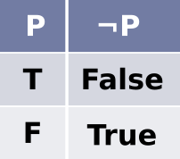
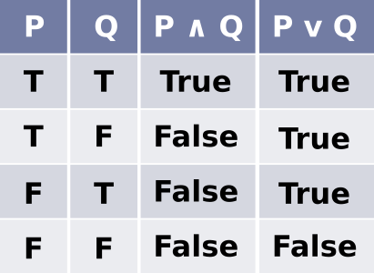

# Operadores lógicos e tabela verdade

Do mesmo modo que operadores matemáticos são usados para resolver expressões matemáticas e seu resultado é um valor numérico; os operadores lógicos são usados para resolver expressões lógicas e seu resultado é um valor lógico.

Desse modo, temos como principais operadores lógicos:

- conectivo de conjunção **E**
- conectivo de disjunção **OU**
- conectivo de negação **NÃO**

Respectivamente, no Python eles são escritos:

- **and**
- **or**
- **not**

Eles funcionam da seguinte maneira:

## Conectivo de conjunção

Representado pelo símbolo: **∧**

Lê-se: **e**

Supondo que temos duas premissas **P** e **Q** e que ambas têm o valor **verdadeiro**, assim:

```py
>>> P = True
>>> Q = True
>>> P and Q
True
```

O resultado será **verdadeiro**.

Se uma delas têm o valor **falso**:

```py
>>> P = True
>>> Q = False
>>> P and Q
False
```

A saída será **falso**.

Se ambas têm o valor **falso**:

```py
>>> P = False
>>> Q = False
>>> P and Q
False
```

Temos o resultado **falso**.

Ou seja, o conectivo **E** só irá retornar verdadeiro **se as duas premissas forem verdadeiras**.


## Conectivo de disjunção

Representado pelo símbolo: **V**

Lê-se: **ou**

Novamente temos duas premissas **P** e **Q** e ambas têm o valor **verdadeiro**, assim:

```py
>>> P = True
>>> Q = True
>>> P or Q
True
```

O resultado será **verdadeiro**.

Se uma delas têm o valor **falso**:

```py
>>> P = True
>>> Q = False
>>> P or Q
True
```

A saída será **verdadeiro**.

Se ambas têm o valor **falso**:

```py
>>> P = False
>>> Q = False
>>> P or Q
False
```

Temos o resultado **falso**.

Ou seja, o conectivo **OU** só irá retornar falso **se as duas premissas forem falsas**.


## Conectivo de negação

Representado pelo símbolo: **¬**

Lê-se: **não**

É o mais simples de todos. Basta inverter o valor da premissa dada.

```py
>>> P = True
>>> not P
False
```



Desse modo, temos a **tabela verdade**:



tags: lógica, álgebra booleana, operador lógico, tabela verdade
