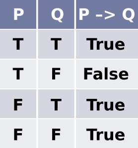

# Tabela verdade: condicional

Na tabela verdade, temos ainda três operadores lógicos:

- conectivo condicional **–>**
- conectivo bicondicional **<–>**
- disjunção exclusiva **⊻**

Eles funcionam da seguinte maneira:

## Conectivo condicional

Representado pelo símbolo: **–>**

Lê-se: **se...então...**

Supondo que temos duas premissas **P** e **Q** com as seguintes **proposições**:

- P: nasci no Amazonas
- Q: sou brasileira

> **proposição** é todo conjunto de palavras ou símbolos que **exprime sentido completo** e que pode ser classificada como verdadeiro ou falso.

E que ambas têm valor **verdadeiro**. Assim:

**P –> Q**

**Se** nasci no Amazonas, **então** sou brasileira.

A sentença é **verdadeira**.

**Antecedente (P):** Se nasci no Amazonas,
**Consequente (Q):** então sou brasileira.

O **antecedente** é sempre lido como **condição suficiente** e o **consequente** é sempre lido como **condição necessária**.

No exemplo dado, **nascer no Amazonas é condição suficiente** para ser brasileira. Da mesma forma, **ser brasileira é condição necessária** para nascer no Amazonas. Pois não é possível nascer no Amazonas e não ser brasileira, visto que o estado do Amazonas é uma unidade federativa do Brasil.

Agora vamos supor que P é **falso**:

- P: **não** nasci no Amazonas
- Q: sou brasileira

Essa sentença continua **verdadeira**, pois a pessoa pode não ter nascido no Amazonas e ser brasileira (ter nascido em qualquer outro estado).

A seguir, vamos supor que P e Q têm valor **falso**:

- P: **não** nasci no Amazonas
- Q: **não** sou brasileira

Essa sentença é **verdadeira**, pois a pessoa pode não ter nascido no Amazonas e não ser brasileira. Ela pode ter nascido na Califórnia, por exemplo, ou qualquer outro local fora do Brasil.

Agora vamos supor que P é **verdadeiro** e Q é **falso**:

- P: nasci no Amazonas
- Q: **não** sou brasileira

Essa sentença é **falsa**. Pois como já foi descrito anteriormente, não é possível nascer no Amazonas e não ser brasileira, visto que o estado do Amazonas pertence ao Brasil.

O conectivo condicional só será **falso** se o **antecedente for verdadeiro** e o **consequente for falso**.

tags: lógica, álgebra booleana, operador lógico, tabela verdade, condicional
