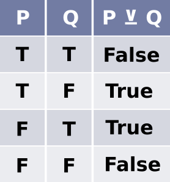
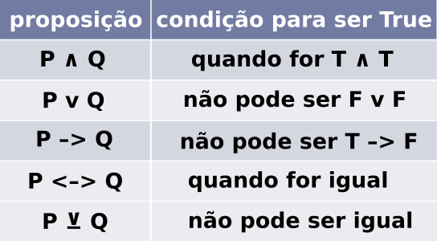

# Tabela verdade: disjunção exclusiva

## Conectivo de disjunção exclusiva

Representado pelo símbolo: **⊻**

Lê-se: **ou...ou...**

Supondo que temos duas premissas **P** e **Q** com as seguintes **proposições**:

- P: estudar
- Q: ir a praia

E que ambas têm valor **verdadeiro**. Assim:

**P ⊻ Q**

**Ou** estudo **ou** vou a praia.

A sentença é **falsa**.

Esse tipo de sentença é aquela que corriqueiramente utilizamos na nossa fala. Pois assumimos que ou a pessoa faz uma coisa, ou fará a outra coisa, mas nunca fará as duas coisas ao mesmo tempo.

O conectivo de disjunção exclusiva será **falso** se as proposições tiverem **valores iguais**. E terá valor **verdadeiro**, se as proposições tiverem **valores diferentes** entre si.

## :sparkles: Dica! :sparkles:

tags: tabela verdade, disjuncao exclusiva, logica
