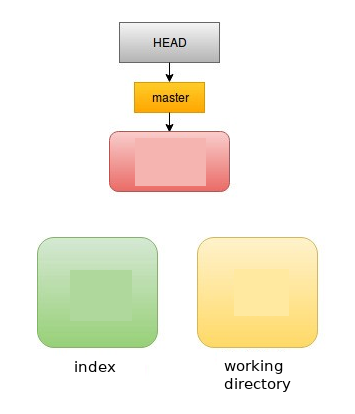
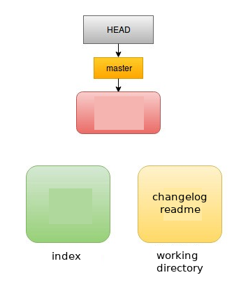
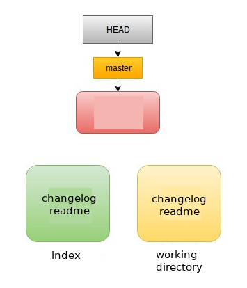

# Adicionando arquivos no Git

Entre na pasta a qual você pretende fazer o versionamento e no terminal digite:
```
$ git init
```
Desse modo a pasta **.git** será criada. É essa pasta que armazenará as imagens das versões do projetos criados.

Para saber o estado atual do git, basta digitar:
```
$ git status
```
No nosso caso será
```
No ramo master
No commits yet

nada para enviar (crie/copie arquivos e use "git add" para registrar)
```



Vamos criar alguns arquivos para teste:
```
$ touch readme changelog
```
Digitando novamente o git status, temos:
```
No ramo master
No commits yet

Arquivos não monitorados:
  (utilize "git add <arquivo>..." para incluir o que será submetido)

	changelog
	readme

nada adicionado ao envio mas arquivos não registrados estão presentes (use "git add" to registrar)
```



Para adicionar os dois arquivos
```
$ git add readme
$ git add changelog
```
Ou
```
$ git add readme changelog
```

Para adicionar todos os arquivos do diretório
```
$ git add .
```

Para adicionar todos os arquivos de uma determinada extensão
```
$ git add *.txt
```

Verificando o estado do git, temos
```
No ramo master
No commits yet

Mudanças a serem submetidas:
  (utilize "git rm --cached <arquivo>..." para não apresentar)

	new file:   changelog
	new file:   readme
```
Aqui, estamos na staging area (index). Algo como uma sala de espera do git.



tags: git, init, add, status
