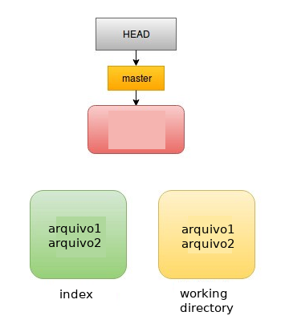
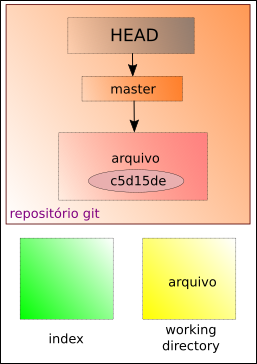

# Removendo arquivos do index

Vamos supor que temos dois arquivos:
```
$ ls
```
```
arquivo1 arquivo2
```
Ao adicionarmos os dois ao git
```
$ git add arquivo1 arquivo2
```
ou
```
$ git add .
```
percebemos que adicionamos o arquivo2 sem querer.



Assim, para removê-lo usamos o comando:
```
$ git reset HEAD arquivo2
```

Ao verificarmos o estado do git,
```
$ git status
```
temos
```
No ramo master
Mudanças a serem submetidas:
  (use "git reset HEAD <file>..." to unstage)

	new file:   arquivo1

Arquivos não monitorados:
  (utilize "git add <arquivo>..." para incluir o que será submetido)

	arquivo2
```



tags: git, reset, index, head
