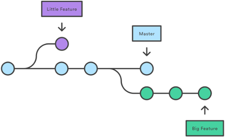

# O que são branches (ramos) no Git?

De maneira simplificada, os **ramos (branches)** no Git são semelhantes a um ramo de uma árvore, onde o tronco seria a base do código. Desse modo é possível criar diversos ramos e fazer alterações, enquanto a base permanece intacta. Por padrão o ramo principal é denominado de **master**.



Para criar um ramo, digite
```
$ git branch <nome do ramo>
```
Para ir até o ramo criado
```
$ git checkout <nome do ramo>
```
Para usar um atalho para esses comandos acima
```
$ git checkout -b <nome do ramo>
```
Desse modo o ramo será criado e em seguida irá transferi-lo para.

tags: git, branch, checkout, ramo
