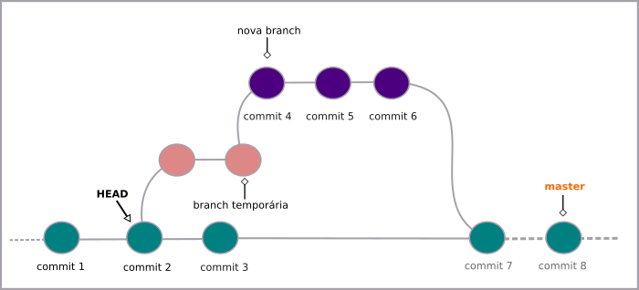
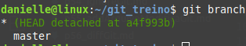
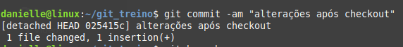

# Desfazendo commits (checkout)

Para voltar ao commit anterior, digite:
```
$ git checkout HEAD~1
```

Aqui é importante notar que será criado um ramo temporário.



Você pode confirmar isso através do comando
```
$ git branch
```
O retorno será algo semelhante a:



Nesse ponto, você estará visualizando as alterações que foram feitas até esse commit.

Após fazer os testes e/ou alterações, basta fazer o commit. Aqui será apresentado uma chave ao lado do commit. Exemplo:



Para não perder as informações é necessário criar um novo ramo, desse jeito:
```
$ git branch <nome do novo ramo> <chave do útimo commit>
```
Em seguida basta ir até o novo ramo criado com o comando
```
$ git checkout <nome do novo ramo>
```

tags: checkout, git, commit, head
