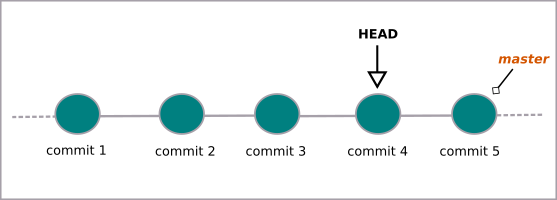
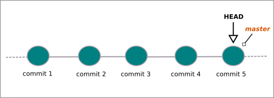

# Desfazendo commits (checkout)

Para voltar ao commit anterior, digite:
```
$ git checkout HEAD~1
```



Caso queira retornar ao último commit, use o comando:
```
$ git checkout master
```



tags: checkout, git, commit, head
