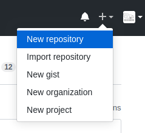
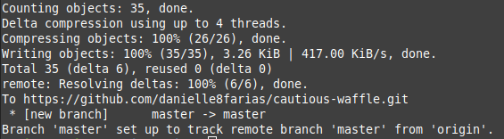

# Enviando um projeto para o repositório remoto no GitHub


Acesse sua conta no [GitHub](https://github.com/). Caso ainda não tenha, basta criá-la (é fácil e rápido).

Clique o sinal de mais para abrir o menu e em seguida em **New repository**.



Dê o nome de sua preferência, além da descrição e se seu repositório será público ou privado.


Para finalizar, clique em **Create repository**.

Em seguida aparece uma tela com três opções:


- A primeira diz respeito a crianção de um novo repositório (inclui a inicialização do Git no diretório).

- A segunda diz respeito a um repositório já existente e que desejo colocar no GitHub (é a situação que irei utilizar).

- A terceira diz respeito a importação de um código de outro repositório.

Sendo assim, dentro da pasta do nosso projeto, digitamos o comando:
```
$ git remote add origin <link para o repositório do seu projeto>
```
para fazer a ligação com o repositório remoto.

No meu caso:
```
$ git remote add origin https://github.com/danielle8farias/cautious-waffle.git
```
Logo após
```
$ git push -u origin master
```
Será pedido seu nome de usuário e sua senha do GitHub:


Se tudo estiver certo o retorno será algo similar a:



Indicando a criação do ramo **master** dentro do GitHub.

tags: git, github, repositorio, remoto
