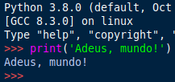

# Goodbye World com Python


É possível imprimir "Adeus, Mundo!" diretamente na tela, no modo interativo do interpretador.

Primeiro, pelo terminal, chame o **interpretador do Python**:

```
$ python3.8
```

- **$** indica que você deve usar o **usuário comum** para fazer essa operação.

Nesse caso, eu estou utilizando a versão 3.8 do **Python**.

E então na tela, digite e aperte o enter.



A função **print()** vai imprimir na tela o caractere que for inserido entre parenteses.

Para inserir strings usa-se **aspas simples** ou **duplas**.

Caso deseje fazer um **script** para executar, basta escrever (e salvar) o código acima no seu **[editor de texto](../linux/p0004_VSCode.md)** favorito.

Para executá-lo, chame o interpretador do **Python**, seguido do nome do seu arquivo e a extensão.

Exemplo:

```
$ python3.8 goodbyeWorld.py
```

imagem: [Pie Comic](https://piecomic.tumblr.com)

tags: python, programacao, print, helloworld
