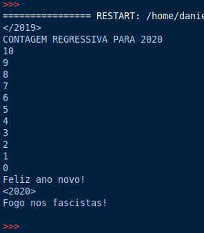

# Contagem regressiva para 2020 com Python

```py
# importando método sleep que suspende a execução por alguns segundos
from time import sleep
# imprimindo cabeçalho
print('</2019>')
# pausa de 1 segundo
sleep(1)
print('CONTAGEM REGRESSIVA PARA 2020')
# laço que começa em 10 até 0 com passo -1
for cont in range(10, -1, -1):
    # imprimindo o contador
    print(cont)
    # pausa de 1 segundo
    sleep(1)
# imprimindo as mensagens 
print('Feliz ano novo!')
print('<2020>')
print('Fogo nos fascistas!',end='\n\n')
```

O resultado será:



tags: 2019, 2020, anoNovo, python
