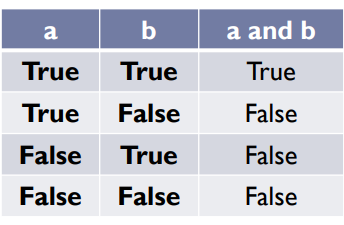
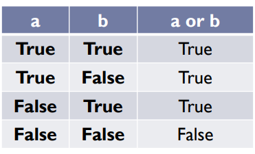
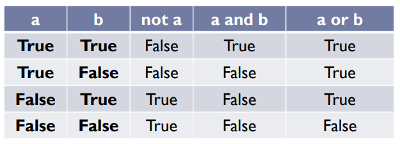
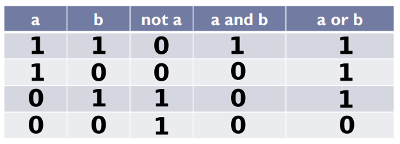

# Operadores lógicos e tabela verdade

Do mesmo modo que operadores matemáticos são usados para resolver expressões matemáticas e seu resultado é um valor numérico; os operadores lógicos são usados para resolver expressões lógicas e seu resultado é um valor lógico.

Desse modo, temos como principais operadores lógicos:

- conectivo de conjunção **E**
- conectivo de disjunção **OU**
- conectivo de negação **NÃO**

Respectivamente, no Python eles são escritos:

- **and**
- **or**
- **not**

Eles funcionam da seguinte maneira:

## and (e)

Supondo que temos duas premissas **a** e **b** e que ambas têm o valor **True**, assim:

```py
a = True
b = True
print(a and b)
```

O resultado será

```
True
```

Se uma delas têm o valor **False**:

```py
a = True
b = False
print(a and b)
```

A saída será

```
False
```

Se ambas têm o valor **False**:

```py
a = False
b = False
print(a and b)
```

Temos o resultado

```
False
```

Ou seja, o conectivo **E** só irá retornar verdadeiro se as duas premissas forem verdadeiras.



## or (ou)

Novamente temos duas premissas **a** e **b** e ambas têm o valor **True**, assim:

```py
a = True
b = True
print(a or b)
```

O resultado será

```
True
```

Se uma delas têm o valor **False**:

```py
a = True
b = False
print(a or b)
```

A saída será

```
True
```

Se ambas têm o valor **False**:

```py
a = False
b = False
print(a or b)
```

Temos o resultado

```
False
```

Ou seja, o conectivo **OU** só irá retornar falso se as duas premissas forem Falsas.



## not (não)

É o mais simples de todos. Basta inverter o valor da premissa dada.

```py
a = True
not a
```

O resultado será

```
False
```


Desse modo, temos a tabela verdade:



Substituindo **True** por **1** e **False** por **0**, temos:



tags: tabelaVerdade, operadorLogico, algebraBooleana, python
