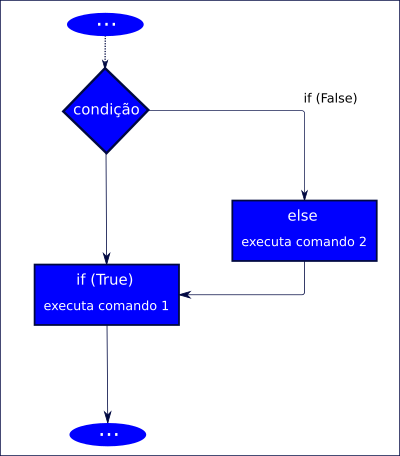

# Estruturas de tomada de decisão (desvio condicional) em Python


As estruturas de tomada de decisão são utilizadas quando o programa precisa decidir, entre mais de uma opção, qual caminho tomar.

## Condicional simples

O **if** é uma estrutura de condição que permite avaliar uma expressão passada e, de acordo com o resultado, executar um determinado bloco de comandos.

```py
if (expressão que pode ser verdadeira ou falsa):
    <executa se verdade>
```

Se a condição após o **if** for verdade, o bloco de comando dentro dele será executado. Esse bloco de comando precisa estar indentado (recuo com a tecla TAB).

Exemplo:

```py
num1 = int(input('Digite um número inteiro: '))
num2 = int(input('Digite outro número inteiro: '))

subtracao = num1 - num2

if subtracao > 0:
    print('O resultado é positivo')

print(f'Valor da subtração = {subtracao}')
```

Acima, podemos conferir que, se o valor da subtração der maior do que zero (número positivo), então o programa imprime na tela a mensagem *"O resultado é positivo"*.

O último print, com o valor da subtração, será sempre impresso, independente de entrar no **if** ou não, pois ele está fora da indentação. O interpretador entende que esse bloco de comando não faz parte da condicional.

## Condicional composta

Além do **if**, a estrutura condicional composta usa o **else**.



Exemplo:

```py
num1 = int(input('Digite um número inteiro: '))
num2 = int(input('Digite outro número inteiro: '))

subtracao = num1 - num2

if subtracao > 0:
    print('O resultado é positivo')
else:
    print ('O resultado é negativo')

print(f'Valor da subtração = {subtracao}')
```

Para usar o **else** deve-se sair da indentação e do mesmo modo que o **if**, colocar o bloco de código indentado após os dois pontos.

O **else** será executado apenas se o **if** for falso. No exemplo acima, temos: se a subtração for maior do que zero, então entra no bloco de comando do **if**, senão, entra no bloco do **else**.

## Expressão condicional

É aquela, onde o desvio condicional pode ser escrito em uma linha. Usando o primeiro exemplo:

```py
num1 = int(input('Digite um número inteiro: '))
num2 = int(input('Digite outro número inteiro: '))

subtracao = num1 - num2

print('subtração negativa' if subtracao < 0 else 'subtração positiva')
```

Aqui, o **desvio condicional** está dentro do **print**. Lê-se, *"imprima 'subtração negativa' se a variável __subtração__ for menor do que zero, senão, imprima 'subtração negativa'."*

## Condicional aninhada

É usada quando é necessário fazer mais de um teste lógico. Exemplo:

```
Faça um programa que calcule a média de duas notas.
Se a média for menor do que 5, o aluno está reprovado.
Se a média for entre 5 e 7, o aluno está de recuperação.
Se maior do que 7, está aprovado.
```

```py
# recebendo as notas dos alunos
nota1 = float(input("Digite a primeira nota: "))
nota2 = float(input("Digite a segunda nota: "))
# calculando a média
media = (nota1 + nota2)/2
# imprimindo a média na tela
print(f'A média da nota é {media}')
# se a média for menor do que 5
if media < 5:
    print('Reprovado')
# senão
else:
    # se a média for entre 5 e 7
    if media > 5 and media < 7:
        print('Recuperação')
    # esse senão pertence ao if
    else:
        print('Aprovado!')
```

Observe que após o primeiro **else** existe um **if** e outro **else** dentro. Esses dois últimos só serão "acionados" quando a condição do primeiro **if** for falsa.

Uma versão simplificada do **else** seguido do **if**, é o **elif**. Usando o exemplo anterior, temos

```py
# recebendo as notas dos alunos
nota1 = float(input("Digite a primeira nota: "))
nota2 = float(input("Digite a segunda nota: "))
# calculando a média
media = (nota1 + nota2)/2
# imprimindo a média na tela
print(f'A média da nota é {media}')
# se a média for menor do que 5
if media < 5:
    print('Reprovado')
# senão se a média for entre 5 e 7
elif media > 5 and media < 7: # perceba que aqui usamos o conectivo de conjunção E(and)
    print('Recuperação')
# senão
else:
    print('Aprovado!')
```

tags: python, if, else, elif
