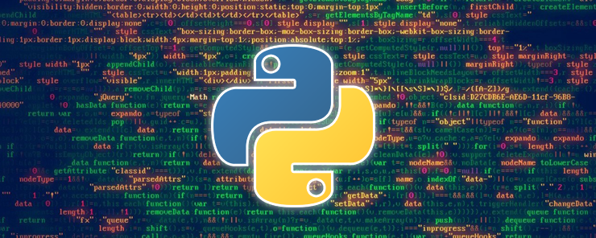

# Introdução ao Python

## História do Python

**Python** foi criada na Holanda em 1989 pelo programador **Guido Van Hossum**, que trabalhava no Centro de Matemática e Ciência da Computação (CWI), em Amsterdam.

O nome Python foi uma homenagem ao programa de TV Inglês, Monty Python Flying Circus, e foi ideia do próprio Van Hossum, já que os projetos dentro do CWI tinham nomes de programas de televisão.

Atualmente a linguagem é mantida por uma fundação sem fins lucrativos chamada **Python Software Foundation**, que é apoiada por várias empresas, entre elas o Google e a Microsoft.

**Python** é uma linguagem multiplataforma, interpretada, de propósito geral, fácil e intuitiva.

tags: python, historia