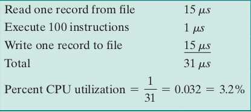
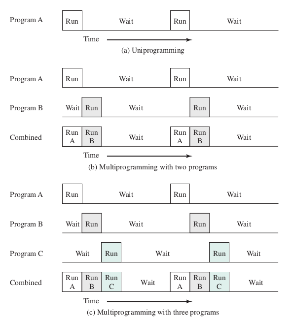

# Sistemas operacionais

## Sistemas multitarefas

Se temos uma máquina que executa, em média, 100 instruções por registro, então esse computador pode gastar mais de 96% do tempo aguardando que os dispositivos de E/S concluam a transferência de dados. Desse modo, o processador deve aguardar até que as instruções de E/S sejam concluídas antes de continuar.

Esse tempo oscioso faz com que o computador perca eficiência. Para contornar isso, usa-se a abordagem de multitarefa que, como sugere o nome, consiste na alternância de tarefas. Assim o processador, enquanto espera os dispositivos de E/S de um processo, pode alternar pra cuidar de um outro que está a espera e não depende desse anterior.

O recurso que deve estar disponível para que o sistema multitarefa funcione é, basicamente, o suporte a interrupções dos dispositivos de E/S e o acesso direto a memória. Pois, com vários programas prontos para rodar, eles precisam ser mantidos na memória, requisitando alguma espécie de gerenciamento de memória. Desse modo, o processador pode decidir qual programa rodar através de um algoritmo de escalonamento.

---

**Referência**

*Stallings, W. (2018). Operating Systems: Internals and Design Principles, páginas 78-80. Pearson Education.*

tags: so, sistema operacional, processo, multitarefa