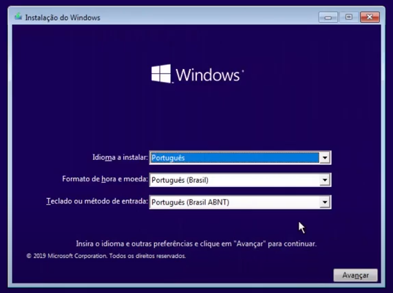
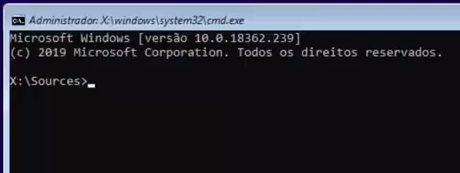
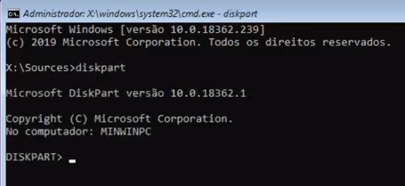
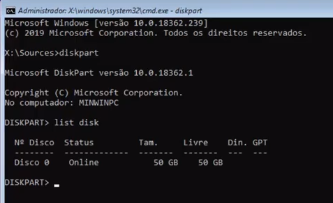
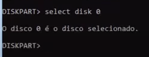
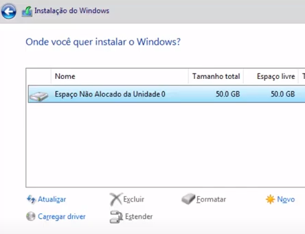

# O Windows Não Pode Ser Instalado Em Partições GPT

Erro comum durante a instalação do Windows 10 que está relacionado ao disco em estilo GPT.

Esse problema ocorre quando o usuário formata o HD usando um padrão de partições para EFI em PCs antigos (que possuem BIOS) e que são compatíveis apenas com o modo MBR.

Durante a tela inicial de instalação do Windows 10, pressione as teclas **shift** e **F10** juntos.



Aparecerá a tela do cmd:



Digite o comando

```
diskpart
```

Ele retornará algo como:



Agora digite:

```
list disk
```

Ele retornará a lista de todos os discos na máquina:



Selecione o disco que você deseja fazer a instalação; no meu caso é o disco 0 e digite:

```
select disk 0
```



Digite 

```
clean
```

para limpar o disco (todas as informações anteriores serão apagadas). Em seguida digite:

```
convert gpt
```

para converter o disco para esse formato.

Agora é possível continuar com a instalação do Windows 10. Casos seja necessário, atualize a lista de discos no momento da escolha do local de instalação.



tags: windows, instalação, gpt
